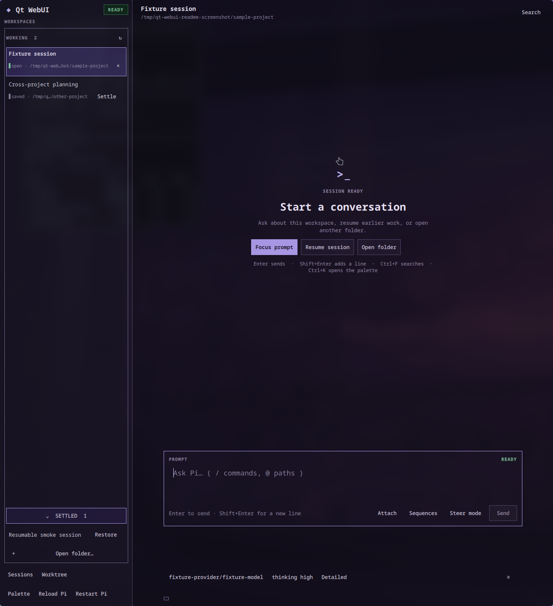

# Qt WebUI

Use Pi in a Linux desktop window built with Quickshell and Qt Quick.

## What you can do

- Keep your prompt text until acceptance, and read assistant answers as they stream. Drag to select readable text in transcripts, dialogs, paths, status details, and row metadata, including syntax-highlighted code; Markdown still renders headings, lists, tables, quotes, and links.
- Attach text files and images to a prompt, complete `/` commands and `@` workspace paths while typing, keep an unsent draft per session, and save prompt sequences you run again later.
- See what Pi is doing: thinking sections you can show or hide, and a single-line row for every tool call with muted argument details beside its name, status, duration, an expand arrow, and a copy-output icon.
- Answer questions from Pi extensions in native dialogs: pick an option, confirm, type a value, or edit text.
- Steer a running task, queue a follow-up, or abort it; restart Pi or the local backend after a failure.
- Work in a focused violet-charcoal or light counterpart layout with a resizable workspace rail, a readable centered conversation, and a clearly framed prompt editor.
- Search the compact transcript, use browser-style middle-click autoscroll, copy any message, and return to new output with **Latest**.
- Get a desktop notification naming the relevant **Working** session when it finishes or Pi needs input; **Settled** sessions stay quiet until restored.
- See the active provider, model ID, and thinking effort beside the prompt. Open **Status** when you want the full Pi, Git, usage, and extension details.
- Choose a model from Pi's current scoped-model list, drag explicitly scoped models into a preferred order that persists across restarts, and set thinking effort from drop-ups above the prompt control strip; configure tool, skill, and sampling profiles or compact long conversations from the same strip.
- Search saved Pi sessions from every project by title or folder in one rail, keep active work in **Working**, move idle sessions to the collapsible **Settled** section, bulk-settle large backlogs, and restore them whenever you need them.
- Open several projects in tabs, each with its own Pi session, reuse the tab for an already-open saved session, open another saved session in a new tab, and start a Git worktree for a new branch in its own tab.
- Reach every action, tab, model, session, and Pi command from one keyboard-first palette (`Ctrl+K`), inspect context and token usage in **Status**, and review events and diagnostics without leaving the window.
- Work in the project directory where you started `qt-webui` (your tabs come back after a restart), follow live desktop light/dark changes, or choose Automatic, Light, Dark, or an installed Pi JSON theme without changing Pi's own theme setting.

## Install

Install it as a Pi package to add the `/qt-webui-start` command:

```bash
pi install npm:@firstpick/pi-package-qt-webui
```

For a standalone terminal command instead, install it globally with npm:

```bash
npm install -g @firstpick/pi-package-qt-webui
```

## How to use it

After installing the Pi package, start Pi in the project you want to open:

```bash
cd ~/projects/example
pi
```

Then enter this command inside Pi:

```text
/qt-webui-start
```

The command starts Qt WebUI for Pi's current working directory and returns immediately, leaving Pi open. With the global npm installation, run `qt-webui` from the project directory instead.

Choose a session from **Working** in the left rail. Use **Search workspaces** above the lists to filter loaded **Working** and **Settled** rows by session title, identifier, or folder. Search is case-insensitive; press `Escape` or choose **×** to restore every row. Selecting a session that is already open switches to its tab; selecting another saved session opens it in a new tab and leaves your current tab intact. If another Pi window saves that session, Qt WebUI refreshes the saved-session list and, while the tab is idle, replaces its transcript with the latest complete saved conversation; a background tab gains an unread marker. Use **Settle** to move an idle session out of the active list. When more than 100 saved sessions remain in **Working**, a floating **Settle All** button moves every eligible idle session to **Settled** and then disappears as the count reaches 100 or fewer. Active runs stay in **Working**, and a notice summarizes skipped sessions. Both lists show compact last-activity labels: minutes or hours below one day, whole days through `30d`, then `dd.mm.yyyy` for older sessions. When an existing session gets new activity, its row stays in place for five minutes. Qt WebUI then moves it into last-activity order, which keeps active rows from jumping around while you work. The **Settled** section starts expanded, can be collapsed, and keeps each row quiet with the title, activity label, and **Restore**. Settled sessions do not send desktop notifications if later background activity finishes or requests input. Restoring never changes the saved conversation. Closing a tab does not settle it, and settling a session does not close its tab. When you close the session you are viewing, the main workspace stays empty instead of selecting or creating another session. Other open sessions remain in **Working** until you choose one.

Open session rows and tabs show one of four activity labels. `blocked` means Pi needs your input, `working` means a run is active, `done` marks a background run you have not viewed, and `idle` means no run needs attention. Selecting a `done` tab clears that marker. Process errors remain visible separately.

By default, Qt WebUI also settles closed sessions after 30 days without activity. Open **More options**, choose **Automatic settlement**, and enter 1–3,650 days to change the delay. Lowering it can move older closed sessions to **Settled** as soon as you save; open tabs stay in **Working**, and **Restore** gives a session a fresh grace period.

Open **More options** and choose **Theme** to use Automatic, Light, Dark, or a Pi JSON theme from your normal Pi theme locations and installed packages. For example, themes from `@firstpick/pi-themes-bundle` appear after that package is installed and enabled in Pi. If a saved theme disappears or becomes invalid, Qt WebUI uses your last built-in appearance and retries the saved choice when the theme returns.

Drag the rail's right edge to resize it, or focus that edge with `Tab` and press `Shift+Left` / `Shift+Right`. The rail can use the available window width instead of stopping at a fixed maximum. Middle-click the transcript to start autoscrolling. Move the pointer above or below the starting marker to scroll up or down; moving farther away increases the speed. Click again or press `Escape` to stop. If you scroll up in a transcript, use **Latest** to return to the newest output and follow new messages again. Then type in the prompt editor below the centered conversation and press `Enter` (`Shift+Enter` adds a new line). The prompt control defaults to **Steer mode**. Switch it to **Follow-up mode** when you want `Enter` and the nearby run action to queue the next prompt instead; `Alt+Enter` always queues a follow-up. The **Abort** button stops the run, and three animated dots under the last entry show that Pi is still working. The three-line **More options** menu below the prompt holds Resources, automatic settlement, display preferences, Events, and Diagnostics without crowding the main window. **Status** opens the Pi, Git, usage, and extension details above the control strip, so those rows do not occupy the window while you are writing or reading. When an extension asks a question, a dialog opens with the choices; `Escape` cancels it.

Tool calls start collapsed. Click **▸** to reveal the argument summary, errors, and output, or **⧉** to copy the available output without expanding. The copy icon is disabled until output arrives. Failed calls stay marked **Failed** even when collapsed.

Your prompt stays in the editor until accepted. Rejection keeps it available to edit. If a submission times out, its outcome is unknown, so check the session before trying again. Extension answers stay open while submitting and after rejection; a timeout never resends an answer automatically.

You can drag to select readable dialog text, paths, status values, and list metadata without choosing an option or opening a link. Buttons and other controls still act normally. A long selectable field may clip to fit its space; focus it and press `Ctrl+A`, then `Ctrl+C`, to copy its complete original text.

If the workspace list is incomplete, a small warning icon appears beside **Search workspaces**. Hover over it or focus it with `Tab` to read the warning; it does not appear in your session.

## Main window



The screenshot uses the package's deterministic fake-session environment; it contains no real project or conversation data.

Tool rows show argument details, such as a file path or command, beside the tool name, ending with `...` when they do not fit. Widen the window to see more, or use **▸** to expand the summary and output.

Useful shortcuts:

- `Ctrl+F` searches the transcript; `Enter` and `Shift+Enter` move between matches.
- `Ctrl+T` shows or hides thinking sections.
- `Ctrl+L` returns focus to the prompt.
- `Ctrl+M` opens Pi's scoped-model list above the model control. When Pi supplies an explicit scope, drag the **≡** handle or press `Ctrl+Shift+Up` / `Ctrl+Shift+Down` to reorder it. `Ctrl+E` opens thinking effort; `Ctrl+Shift+P` and `Ctrl+Shift+E` cycle through the model and effort lists.
- `Ctrl+Shift+R` opens **Resources** from the **More options** menu for enabled tools, enabled skills, and model-supported sampling values.
- **Sequences** in **More options**, or `Ctrl+Shift+S`, opens your saved prompt sequences. `Ctrl+Shift+A` attaches files.
- Type `/` to complete a command or `@` to complete a workspace path; `Tab` or `Enter` completes without sending.
- `Ctrl+N` opens a tab in the same folder, `Ctrl+O` picks another folder, `Ctrl+W` closes the active tab and leaves no session selected, and `Ctrl+Tab` switches tabs. `Ctrl+Shift+O` resumes a saved session, `Ctrl+Shift+N` starts a new one, and `Ctrl+Shift+B` creates a Git worktree.
- `Ctrl+K` opens the command palette, where you can cycle Automatic/Light/Dark appearance and reduced motion; `Ctrl+Shift+L` opens event history and `Ctrl+Shift+D` opens diagnostics.

Tool and skill choices are shared with Pi Web UI. A global, model, or saved-session selection changed in either interface is the selection the other interface reads; opening **Resources** refreshes the latest shared state before you edit it. Sampling choices remain specific to Qt WebUI.

Links in answers open in your default application only after you confirm the full address. Your display choices are saved between sessions.

For QML development, start the packaged source configuration with native reload enabled:

```bash
qt-webui dev
```

Saving a QML file while this development command is running lets Quickshell reload the installed configuration.

## Before you start

Qt WebUI requires Linux, a Wayland desktop session, Quickshell 0.3 or newer, Node.js 22.19 or newer, and the `flock` command from util-linux. It uses your existing Pi credentials and settings; it never asks you to enter provider secrets.

Pi runs with access to the directory where you launch the app. Review prompts, tool cards, extension dialogs, and resource profiles just as you would in Pi's terminal interface, because enabled tools and skills can read or change project files. An empty profile intentionally disables every item in that category; **Inherit** does not. If Pi is using an ephemeral session, Qt WebUI warns that a session profile applies only until that session ends instead of claiming it was saved.

Theme selection stays in Qt WebUI's private settings and never writes Pi's `theme` setting. Theme discovery reads JSON color data only. It ignores arbitrary CSS, gradients, and images from HTML export fields and does not execute package extensions.

## Technical details

See [TECHNICAL.md](TECHNICAL.md) for complete commands, requirements, settings, security behavior, limitations, and troubleshooting information.
