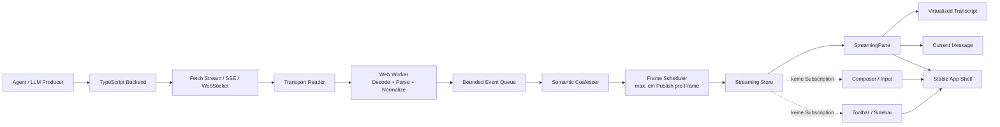
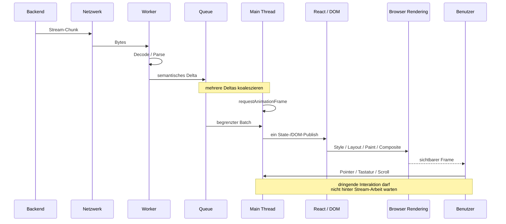
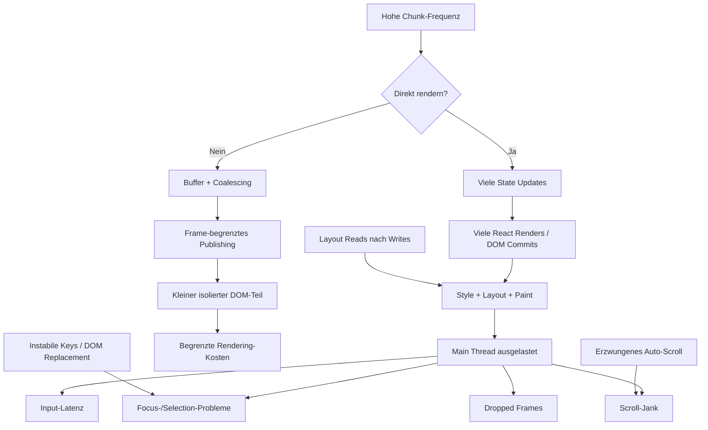
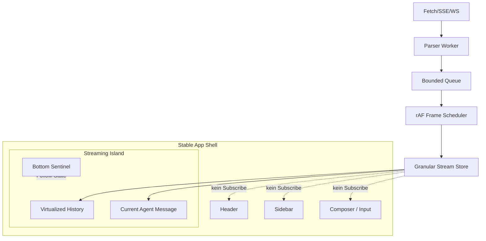
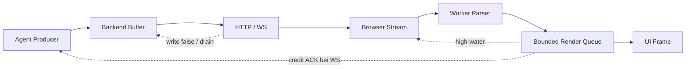
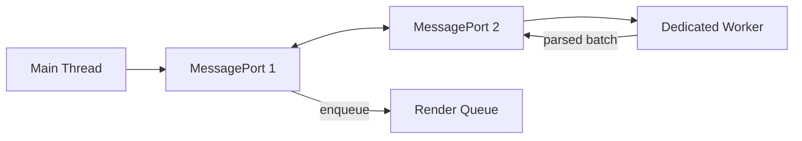
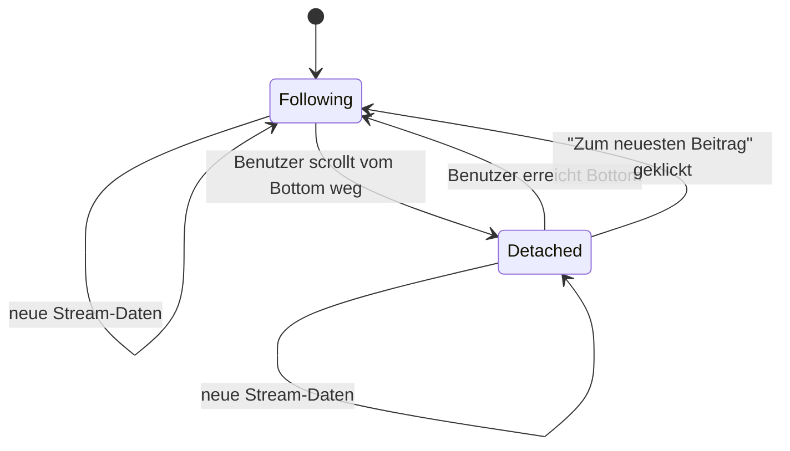

# Robuste Streaming-UIs für kontinuierliche Agent-Ausgaben in TypeScript

## Executive Summary

Bei einer kontinuierlich streamenden Agent-Ausgabe entsteht UI-Flackern fast nie durch „Streaming“ an sich. Die typischen Ursachen liegen vielmehr darin, **wie häufig eingehende Daten bis in React/DOM gelangen, welche Teile des Komponentenbaums davon abhängig sind und welche synchronen Arbeiten pro Update auf dem Main Thread ausgelöst werden**. Besonders problematisch sind eine Zustandsänderung pro Token, wiederholte DOM-Ersetzungen, instabile React-Keys, Layout-Reads zwischen DOM-Writes, vollständiges Neuparsen von Markdown bei jedem Delta sowie erzwungenes Scrollen oder Fokussieren nach jedem Chunk. Forced Reflows können JavaScript anhalten, während der Browser Style und Layout synchron neu berechnet; Chrome DevTools kann solche Forced Reflows inzwischen einschließlich verursachendem Stack und kumulierter Dauer sichtbar machen. citeturn0search4turn0search7turn8search2

Die wichtigste Architekturregel lautet deshalb:

> **Die Netzwerkfrequenz darf nicht die Renderfrequenz bestimmen.**

Ein Agent darf beispielsweise hunderte kleine Deltas pro Sekunde liefern; daraus sollten jedoch **gebündelte, begrenzte UI-Updates** entstehen. Ein empfehlenswerter Pfad ist:

**Transport → Byte-/Event-Decoding → optional Web Worker → semantische Koaleszierung → begrenzte Queue → höchstens ein Publish pro Render-Frame → isolierter Streaming-Store → nur Streaming-Komponenten → virtualisierte sichtbare Ausgabe.**

`requestAnimationFrame()` eignet sich dazu, visuelle Änderungen an die nächste Paint-Gelegenheit zu koppeln; es wird typischerweise im Rhythmus der Display-Refresh-Rate aufgerufen und in Hintergrund-Tabs pausiert. Das bedeutet allerdings nicht, dass `requestAnimationFrame()` ein allgemeiner Event-Throttler ist: MDN warnt beispielsweise ausdrücklich davor, Scroll-Events damit zu „throttlen“, weil Scroll-Events und `requestAnimationFrame` ungefähr mit derselben Frequenz auftreten können. citeturn3search0turn1search0

Für eine React-Anwendung sollte der **Composer/Input-Bereich nicht von Streaming-State abhängen**. Der Hot Path gehört in einen kleinen, separat abonnierenden `StreamingPane` beziehungsweise in noch granularere Message-Komponenten. React verbindet State mit einer Position und Identität im Renderbaum; wechselnde Keys oder ein Entfernen und erneutes Einfügen einer Komponente können daher State und Fokus verlieren lassen. Die React-Dokumentation nennt wechselnde Keys und während des Renderns neu definierte Komponenten explizit als typische Ursachen dafür, dass Inputs nach jeder Eingabe aus dem DOM entfernt und neu hinzugefügt werden. citeturn6search0turn6search1turn0search20

Für den Transport ist bei einem unidirektionalen Agent-Response **`fetch()` mit `ReadableStream` häufig die attraktivste Ausgangsbasis**, weil Response-Bodies inkrementell gelesen werden können und die Streams API ein explizites Backpressure-Modell besitzt. Die klassische Browser-`WebSocket`-API besitzt dagegen laut MDN **keinen Mechanismus für eingehendes Backpressure**: Treffen Messages schneller ein als die Anwendung sie verarbeitet, können Speicherverbrauch und CPU-Last unkontrolliert steigen. `EventSource`/SSE ist ebenfalls ein unidirektionaler Push-Kanal; die Browser-API stellt dem UI-Consumer keine vergleichbare `ReadableStream`-Backpressure-Schnittstelle zur Verfügung. citeturn3search3turn3search1turn15search1turn3search2

Die robuste Lösung braucht **zwei verschiedene Backpressure-Ebenen**:

1. **Transport-/Producer-Backpressure:** Der Server soll nicht unbegrenzt in einen langsamen Socket schreiben. Bei Node.js signalisiert `ServerResponse.write()` mit `false`, dass Daten im Userspace gepuffert werden; auf `'drain'` kann anschließend gewartet werden. Node Streams und `pipeline()` implementieren entsprechende Flusskontrolle. citeturn13search3turn13search0
2. **Render-Backpressure:** Auch wenn das Netzwerk schnell ist, darf die UI nur eine begrenzte Menge Arbeit pro Frame übernehmen. Benachbarte reine Text-Deltas können verlustfrei zusammengefasst werden; strukturierte Ereignisse wie Tool-Calls, Statuswechsel oder Fehler sollten dagegen nicht verworfen werden. Das ist eine Architekturentscheidung, nicht eine Eigenschaft des Protokolls.

Web Workers sind besonders wertvoll für JSON-/NDJSON-/SSE-Framing, Markdown-Parsing, Tokenisierung oder andere CPU-intensive Verarbeitung, weil sie auf einem separaten Thread laufen und nicht direkt auf das DOM zugreifen können. Große Binärpuffer können über Transferables statt durch Kopieren übertragen werden. `MessageChannel` eignet sich als explizite Kommunikationsgrenze zwischen Worker, App und gegebenenfalls iframe. citeturn2search0turn2search2turn14search1turn14search5turn14search9

Die **höchste Priorität** sollte daher nicht auf exotischer Isolation wie Shadow DOM oder iframes liegen, sondern auf: stabile Komponentenidentitäten, kleine Streaming-Abonnements, Frame-Batching, begrenzte Queues, Worker-Offload für CPU-Arbeit, korrektes Scroll-Following und Virtualisierung. Shadow DOM kapselt DOM und CSS, ein React-Portal verändert primär die physische DOM-Platzierung; keines davon schafft eine eigene Main-Thread-Ressource. Ein iframe stellt dagegen eine echte Dokument- und Fokusgrenze dar und kann insbesondere bei Cross-Site-Inhalten in Chromium zusätzlich in einem anderen Renderer-Prozess landen, bringt aber erhebliche Kommunikations-, Accessibility- und Layoutkosten mit sich. citeturn7search0turn14search3turn9search8turn9search25

**Empfohlene Zielarchitektur:**



Diese Trennung ist entscheidender als die Wahl zwischen React und Vanilla DOM: **Der Datenstrom darf den Rest der Benutzeroberfläche strukturell nicht berühren.**

## Annahmen und Wirkmodell

Für die folgenden Empfehlungen nehme ich an, dass das Frontend moderne Evergreen-Browser unterstützt, React/TSX verwendet, aber Teile bei Bedarf mit Vanilla TypeScript implementiert werden können. Als Backend-Beispiel verwende ich Node.js mit TypeScript; die Prinzipien gelten ebenso für andere JavaScript-/TypeScript-Runtimes, die Web Streams oder vergleichbare Socket-Backpressure-Mechanismen anbieten. Die Agent-Ausgabe bestehe aus geordneten Text-Deltas und eventuell strukturierten Ereignissen wie `tool-start`, `tool-result`, `status` und `error`. Der Eingabe-/Composer-Bereich soll während des Streams vollständig interaktiv bleiben, und das Transcript besitzt einen eigenen Scroll-Container.

### Was zwischen einem Netzwerk-Chunk und einem sichtbaren Pixel passiert

Ein einzelnes empfangenes Delta kann eine überraschend lange Wirkungskette auslösen:



Browserarbeit besteht nicht nur aus React-Rendering. DOM- und Style-Änderungen können Style-Recalculation, Layout, Paint und Compositing verursachen. DOM-Änderungen, Attributänderungen sowie Zustände wie `:hover` oder `:focus` können Style-Neuberechnungen auslösen. Chrome DevTools stellt dafür Main-Thread-Flame-Charts, Paint-Informationen, Layout-Shift-Daten und Selector Statistics bereit. citeturn8search0turn8search2turn8search3

Besonders teuer ist **Layout Thrashing**:

```text
DOM schreiben
↓
Layout-Wert lesen
↓
Browser muss synchron Layout berechnen
↓
DOM wieder schreiben
↓
Layout wieder lesen
↓
...
```

Chrome bezeichnet dies als Forced Reflow, wenn JavaScript den Browser zwingt, Layoutinformationen synchron zu berechnen; häufig entsteht das durch abwechselnde DOM-Writes und geometrische Reads. Ohne geeignete Begrenzung der Layout-Abhängigkeiten kann eine Änderung weit größere Teile der Seite betreffen als das eigentliche Streaming-Element. citeturn0search4turn0search7

Main-Thread-Blockierung ist davon zu unterscheiden. Eine lange Markdown-Konvertierung kann beispielsweise keinerlei Forced Reflow erzeugen und die UI trotzdem unresponsiv machen. Die Long Tasks API bezeichnet Arbeit auf dem UI-Thread ab 50 ms als Long Task; die Long Animation Frames API betrachtet Frames oberhalb von 50 ms und kann auch Fälle erfassen, in denen mehrere kleinere Script-Aufgaben zusammen einen schlechten Frame ergeben. citeturn12search0turn12search1turn12search9

Daraus ergibt sich ein nützlicher Wirkpfad:



### Die relevanten Messgrößen

Eine Streaming-UI sollte nicht primär anhand von „sieht bei mir flüssig aus“ bewertet werden. Chrome DevTools kann Main-Thread-Arbeit, Frames, Recalculate Style, Layout, Paint und Forced Reflows untersuchen; aktuelle Performance-Werkzeuge zeigen außerdem Interaktions- und Layout-Shift-Informationen. React `<Profiler>` stellt unter anderem `actualDuration` und `baseDuration` für Renderarbeit bereit. citeturn8search0turn8search2turn11search2

Für diesen Anwendungsfall empfehle ich zusätzlich eigene Telemetrie. Das sind **anwendungsspezifische SLO-Metriken**, keine Browserstandards:

| Metrik | Bedeutung |
|---|---|
| `chunk_to_paint_ms` | Zeit vom Eingang eines semantischen Deltas bis zu dessen sichtbarem Commit |
| `stream_batches_per_second` | tatsächliche UI-Publish-Frequenz statt Netzwerkfrequenz |
| `pending_stream_bytes` | Größe des noch nicht gerenderten Puffers |
| `pending_stream_events` | Anzahl semantischer Events in der Queue |
| `stream_commit_duration_ms` | React-/DOM-Arbeit eines Streaming-Publishes |
| `focus_loss_count` | unerwartete Änderung von `document.activeElement` |
| `unexpected_scroll_delta_px` | Scrolländerung, obwohl Benutzer nicht im Follow-Modus ist |
| `long_task_count` | Main-Thread-Tasks ≥ 50 ms |
| `forced_reflow_ms` | in DevTools identifizierte erzwungene Layoutarbeit |
| `layout_shift_count` | unerwartete sichtbare Verschiebungen |
| `dropped_or_coalesced_deltas` | getrennt nach erlaubter Koaleszierung und tatsächlichem Verlust |

`document.activeElement` liefert das aktuell fokussierte Element und eignet sich deshalb auch für Testinstrumentierung. Layout Shifts werden durch die `LayoutShift`-Performance-Einträge erfasst; `PerformanceObserver` kann geeignete Performance-Einträge programmatisch beobachten. citeturn5search0turn12search5turn12search8

## Fehlerbilder, Ursachen und konkrete Gegenmaßnahmen

Die folgende Tabelle behandelt die vom Auftrag genannten Problemklassen einzeln. Die kurzen Codefragmente zeigen jeweils die unmittelbarste Mitigation; vollständige Architekturbeispiele folgen anschließend.

| Issue | Symptome | Wahrscheinliche Ursache | Detektionsmethoden: Profiling und Metriken | Konkrete Fixes/Mitigations | TypeScript-Snippet |
|---|---|---|---|---|---|
| **Reflow / Forced Layout** | Text streamt ruckelig; Sidebar oder Composer „springen“; CPU-Spikes | DOM schreiben und anschließend synchron `offsetHeight`, `scrollHeight`, `getBoundingClientRect()` etc. lesen; Layout-Abhängigkeiten reichen weit in die Seite. Forced Reflows blockieren Script bis zur Layoutberechnung. citeturn0search4turn0search7 | Chrome Performance → Forced Reflow, Layout, Recalculate Style; Stack und kumulierte Layoutzeit. citeturn0search4turn8search2 | Reads bündeln, danach Writes bündeln; Layout-Messungen cachen; DOM-Struktur verkleinern; Streaming-Container mit geeigneter CSS-Containment-Grenze versehen. | `const h = el.getBoundingClientRect().height; requestAnimationFrame(() => applyHeight(h));` |
| **Repaint / Paint-Storms** | Kein offensichtliches Layout-Springen, aber Frames fallen aus; Scrollen wirkt zäh | Große Bereiche werden bei jeder visuellen Änderung neu gezeichnet; aufwendige Paint-Effekte oder Animationen bleiben auf dem Main Thread. Browser können Inhalte auf Layers painten und der Compositor kann bestimmte Änderungen günstiger zusammensetzen. citeturn12search18turn12search3 | DevTools Rendering/Paint, Paint Profiler, Layer-/Frame-Analyse. citeturn0search0 | Paint-Fläche reduzieren; Streaming-Panel abgrenzen; unnötige visuelle Effekte vermeiden; für Animationen bevorzugt compositor-freundliche Eigenschaften einsetzen und tatsächliches Verhalten profilieren. | `streamEl.classList.add("stream-surface");` |
| **Main-Thread Blocking** | Input nimmt Zeichen verzögert an; Cursor stockt; Scroll- und Pointer-Events reagieren spät | Markdown, JSON, Syntax-Highlighting, Diffing oder sonstige CPU-Arbeit läuft synchron auf dem UI-Thread. Long Tasks ab 50 ms und Long Animation Frames sind messbar. citeturn12search0turn12search9 | Performance flame chart, Long Tasks/LoAF, Event Timing, CPU-Throttling. citeturn8search3turn12search17 | Parsing in Worker verschieben; Arbeit inkrementalisieren; Ergebnisse bündeln; teure Nachbearbeitung erst nach Absatz-/Message-Ende. | `worker.postMessage(buffer, [buffer]);` |
| **Zu viele DOM-Mutationen** | Flicker, Selection geht verloren, hoher Style-/Layout-Anteil | Jedes Token erzeugt Element/Attribut/Textänderungen; `innerHTML` oder `replaceChildren()` rekonstruiert ganze Teilbäume. DOM-Änderungen können Style-Recalculation auslösen. citeturn8search2 | MutationObserver zur Diagnose; Performance-Aufzeichnung; DOM node count. `MutationObserver` kann `childList`, Attribute und Character Data beobachten. citeturn7search2turn7search4 | Pro Frame einen zusammengefassten Patch; bestehende Nodes weiterverwenden; abgeschlossene Nachrichten unverändert lassen. | `fragment.append(document.createTextNode(batch)); host.append(fragment);` |
| **State Management zu weit oben** | Beim Streamen rendern Composer, Navigation, Toolbar und Modals mit | Stream-State liegt im App-Root, globalem Context oder in einem Store, dessen Snapshot alle Komponenten invalidiert | React Profiler: unnötige Render-Commits; React Performance Tracks können React-Arbeit mit JS/Event-Loop-Aktivität korrelieren. citeturn11search2turn9search27 | Hot Stream-State in kleinen externen Store beziehungsweise lokale Streaming-Insel verschieben; nur benötigte IDs/Messages abonnieren; stabile Props für Geschwister. `useSyncExternalStore` ist React-API für externe Stores. citeturn10search3 | `const text = useSyncExternalStore(subscribe, getSnapshot);` |
| **Virtual-DOM-Diffing auf jedem Delta** | Viele React-Commits trotz minimaler sichtbarer Änderung | Ein State-Update pro Token erzeugt immer wieder Renderarbeit; große Child-Trees werden neu ausgewertet | React Profiler `actualDuration`, Commit-Frequenz. citeturn11search2 | Deltas vor React bündeln; `memo` an stabilen Grenzen; nur aktuelle Message abonnieren; abgeschlossene Messages nicht neu rendern. `memo` kann Renders bei unveränderten Props überspringen, ist aber eine Optimierung und keine semantische Garantie. citeturn0search8 | `const Message = memo(function Message(p: Props) { ... });` |
| **Mutable State / fehlende Immutability** | React erkennt Änderungen inkonsistent; Memoization funktioniert schlecht; schwer reproduzierbare UI-Zustände | Arrays/Objekte im React-State werden in-place verändert | Profiler plus State-Debugging; referentielle Gleichheit testen | React empfiehlt bei Object-/Array-State, neue Werte statt Mutation zu erzeugen. Immutable Snapshots machen Grenzen und Memoization berechenbarer. citeturn6search2turn6search5 | `setItems(prev => [...prev, next]);` |
| **Instabile List Keys** | Input verliert Fokus; Message-State springt; Elemente blinken oder werden neu aufgebaut | `key={Math.random()}`, Index-Keys bei Insert/Reorder, wechselnde Stream-IDs. React verwendet Keys zur Identifikation von Listenelementen; Key-Wechsel kann State zurücksetzen. citeturn6search0turn6search1 | React DevTools; DOM beobachten; Fokusverlust mit `activeElement`; Mount/Unmount-Logging | Persistente IDs vom Backend verwenden; Keys niemals aus Renderzeit/Zeitstempel/Random erzeugen. | `<Message key={message.id} message={message} />` |
| **Komponenten-Remount statt Update** | Composer wird leer; Cursorposition oder Selection verschwindet | Bedingtes Rendering tauscht Elternbaum; Komponente wird innerhalb einer anderen Renderfunktion neu definiert; wechselnder Key | Mount/Unmount-Logs; React Profiler; `document.activeElement` | App-Shell und Composer strukturell stabil halten. React dokumentiert Remounts durch wechselnde Keys bzw. verschachtelte Component-Definitionen als typische Focus-Loss-Ursache bei Inputs. citeturn0search20 | `const Composer = memo(...); // auf Modulebene` |
| **CSS-Animationen** | „Flimmern“, verzögerte Animation, hoher Paint-/Layout-Anteil | Animationen erzwingen Paint oder Layout; viele animierte Stream-Nodes | DevTools Animation/Performance/Paint; Chrome weist non-composited animations als mögliche Jank-Quelle aus. citeturn0search22 | Streaming-Text nicht bei jedem Delta animieren; unnötige Übergänge abschalten; für geeignete Effekte transform/opacity bevorzugen und im Zielbrowser profilieren. citeturn12search3 | `node.animate([{opacity:.8},{opacity:1}], {duration:100});` nur sparsam |
| **Focus Handling** | Eingabefeld verliert Fokus oder Browser scrollt plötzlich zum fokussierten Element | Node wird remountet; Anwendung ruft wiederholt `focus()` auf; Fokus wird nach Stream-Update „repariert“ | `focus`, `blur`, `focusout`; `document.activeElement`. citeturn5search0turn5search8turn5search12 | Primär Remount verhindern. Nur bei wirklich notwendiger Wiederherstellung `focus({preventScroll:true})`; `preventScroll` verhindert das standardmäßige Scrollen beim Fokussieren. citeturn15search2 | `inputRef.current?.focus({ preventScroll: true });` |
| **Scroll wird bei jedem Chunk erzwungen** | Benutzer scrollt hoch, UI zieht ihn sofort wieder nach unten; Scrollposition springt | `scrollTop = scrollHeight` oder `scrollIntoView()` nach jedem Token | `scrollTop` vor/nach Batch instrumentieren; Performance; Benutzer-„pinned“-Status protokollieren | Follow-Modus nur, solange Benutzer tatsächlich am unteren Ende ist; Bottom-Sentinel mit IntersectionObserver; genau eine Scroll-Anpassung pro Render-Batch | `if (pinned.current) scroller.scrollTop = scroller.scrollHeight;` |
| **Scroll Anchoring falsch verstanden** | Inhalte oberhalb verändern Höhe und Viewport verschiebt sich unerwartet | Anwendung kämpft gegen browserseitiges Scroll Anchoring oder deaktiviert es unbedacht | Layout-Shift-Track; Scrollposition vor/nach Resize | Browser-Scroll-Anchoring hält den Viewport bei DOM-Änderungen möglichst stabil. `overflow-anchor` kann dies beeinflussen, hat laut MDN jedoch nicht überall denselben Verfügbarkeitsstatus; deshalb featuretesten. citeturn5search9turn5search1 | `CSS.supports("overflow-anchor","none")` |
| **Teure Event Handler** | Scroll/Pointer/Input fühlen sich unter Streaming schlecht an | High-frequency Handler machen Parsing, DOM-Writes oder State-Updates | Event Timing, Performance flame chart; Handlerdauer messen. citeturn12search17 | Handler minimal halten; Arbeit in Queue verschieben; Scroll-Handler zeitlich throttlen oder IO verwenden. MDN warnt vor aufwendiger Arbeit in schnell feuernden Scroll-Events. citeturn1search0 | `onScroll = throttle(updateScrollState, 50);` |
| **Passive Listener fehlen** | Touch-/Wheel-Scroll kann unnötig auf JavaScript warten | Listener könnte `preventDefault()` aufrufen, Browser kann Scroll-Aktion deshalb nicht sofort behandeln | DevTools/Event Listener; Handlerprofiling | Für Listener, die Scroll nicht verhindern müssen, `{passive:true}` verwenden. Bei passiven Listenern darf `preventDefault()` die Default-Aktion nicht stoppen. citeturn5search7turn5search27 | `el.addEventListener("wheel", observe, { passive: true });` |
| **Pointer Capture fehlt** | Drag/Resize bricht während hoher UI-Aktivität ab, wenn Pointer das Element verlässt | Pointerbewegungen gehen an ein anderes Ziel | Pointer-Event-Logs | Bei Drag/Resize `setPointerCapture(pointerId)` und danach `releasePointerCapture()`. Pointer Capture bestimmt das Ziel zukünftiger Pointer-Events bis zur Freigabe. citeturn5search2turn5search18 | `e.currentTarget.setPointerCapture(e.pointerId);` |
| **WebSocket ohne eingehendes Backpressure** | Receive-Queue wächst; RAM und CPU steigen; UI friert bei Bursts ein | Klassische WebSocket-API nimmt schneller Messages an als Anwendung sie konsumieren kann. MDN beschreibt ausdrücklich fehlendes Backpressure. citeturn15search1 | App-Queue-Depth, heap, Messages/s, Long Tasks | Bounded Queue; Text-Deltas koaleszieren; semantische Events verlustfrei; eigenes Credit-/ACK-Protokoll zum Server; Worker für Parsing | `ws.send(JSON.stringify({type:"credit", n:128}));` |
| **SSE/EventSource-Überlastung** | Viele `message`-Callbacks invalidieren UI | Server pusht unidirektional schneller als Renderpfad sinnvoll verarbeiten sollte. EventSource ist eine persistente `text/event-stream`-Verbindung und unidirektional. citeturn3search2 | Events/s gegen UI-Batches/s vergleichen; Queue-Depth | Message-Callbacks nur enqueueen; Server Deltas koaleszieren; UI nach Frame-Cadence publizieren; bei hartem Flow-Control-Bedarf anderes Protokoll erwägen | `es.onmessage = e => queue.push(e.data);` |
| **Fetch-Stream wird direkt gerendert** | Jeder `reader.read()` führt zu `setState`; viele Commits | Netzwerk-Chunk-Grenze wird fälschlich zur UI-Update-Grenze | Netzwerk-Chunks/s vs React commits/s | `ReadableStream` bewusst als Pipeline behandeln; Reads, Parsing und Renderqueue entkoppeln; bei zu voller Queue das nächste `read()` verzögern. Streams besitzen Queue-/Backpressure-Mechanismen. citeturn3search1turn3search3 | `await queue.waitForCapacity(); const r = await reader.read();` |
| **Web Worker fehlt** | Decoder/Parser konkurriert mit Input und Paint | CPU-intensive Transformation läuft auf Main Thread | Vergleichsprofil Main Thread vs Worker; Long Tasks | Decoder/Parser/Tokenizer in Dedicated Worker. Worker laufen getrennt vom UI-Thread und haben keinen direkten DOM-Zugriff. citeturn2search0turn2search2 | `new Worker(new URL("./parser.worker.ts", import.meta.url), {type:"module"});` |
| **Worker-Kommunikation kopiert zu viel** | Main Thread besser, aber hoher RAM-/GC-Druck | Große `ArrayBuffer`/Objektgraphen werden ständig strukturell geklont | Heap/GC, Message-Latenz, übertragenes Bytevolumen | Binärdaten transferieren; Transferables verschieben Ownership statt die Resource zu kopieren. citeturn14search1 | `worker.postMessage(buf, [buf]);` |
| **`requestAnimationFrame` fehlt** | Mehrere sichtbare Updates innerhalb desselben potentiellen Frames | Jeder Delta-Callback schreibt unmittelbar ins DOM | Commits/s höher als visuell sinnvoll; Performance Timeline | Pending-Deltas sammeln, nur einen rAF reservieren; im Callback einen bounded Patch committen. rAF läuft unmittelbar vor einem Repaint. citeturn3search0 | `raf ||= requestAnimationFrame(flush);` |
| **`requestAnimationFrame` falsch als allgemeines Throttle verwendet** | Scroll-Handler bleibt teuer | Scroll-Event und rAF können ähnlich häufig laufen; rAF reduziert die Rate dann nicht | Handler/s messen | Für Scroll-Logik zeitliches Throttling oder IntersectionObserver einsetzen. MDN weist explizit auf diesen Unterschied hin. citeturn1search0 | `setTimeout(update, 40);` |
| **Kein Batching** | State- und DOM-Update pro Token | Transport-, Parsing- und Rendergrenze sind identisch | Events/s, commits/s, mutations/s | Benachbarte Text-Deltas zusammenfassen; höchstens einmal pro Frame publizieren; serverseitig ebenfalls kleine Deltas aggregieren | `pendingText += delta; scheduleFlush();` |
| **Debouncing an falscher Stelle** | Text erscheint erst nach Pausen statt kontinuierlich | Gesamten Live-Stream debounce-t | Chunk-to-paint-Latenz und sichtbare Pausen messen | Debounce für sekundäre teure Arbeit verwenden, etwa finalen Index, Highlighting oder Preview-Neuberechnung; nicht als primäre Live-Textstrategie | `debounce(rebuildIndex, 250);` |
| **Throttling fehlt oder ist zu aggressiv** | Ohne Throttle CPU hoch; mit zu großem Intervall „Tipwriter“-Lag | Publish-Cadence nicht von Transport getrennt | `chunk_to_paint_ms`, batches/s, dropped frames | Rendering begrenzen; für normale Displays ist Frame-Batching der natürliche obere Takt. Ein niedrigeres explizites Limit kann auf schwachen Geräten sinnvoll sein und muss gemessen werden | `if (now-lastFlush < 33) return;` |
| **CSS Containment fehlt** | Veränderung im Transcript löst großen Layout-/Paint-Bereich aus | Streaming-Bereich ist vollständig in äußere Layout-Abhängigkeiten eingebunden | DevTools Layout/Paint; Vergleich mit/ohne Containment | `contain` kann Layout/Paint/Style-Abhängigkeiten abgrenzen. CSS Containment wurde gerade für solche unabhängigen bzw. dynamischen Teilbäume spezifiziert; semantische Folgen für Sizing/Layout müssen getestet werden. citeturn0search3turn0search6turn0search18 | `panel.style.contain = "layout paint style";` |
| **IntersectionObserver nicht genutzt** | Teure manuelle Sichtbarkeitschecks in Scroll-Handlern | `getBoundingClientRect()` für viele Elemente bei jedem Scroll | Performance/Forced-layout traces | IntersectionObserver beobachtet Überschneidungen asynchron; ideal für Bottom-Sentinel, Lazy Work und Sichtbarkeitsgrenzen. citeturn4search0turn4search2 | `io.observe(bottomSentinel);` |
| **Virtualisierung/Windowing fehlt** | Nach langer Unterhaltung werden auch kleine Updates teuer | Tausende abgeschlossene Message-Nodes bleiben in DOM/React-Baum | DOM node count, React render time, Layoutzeit | Nur sichtbare Region plus Overscan rendern; abgeschlossene Messages per ID stabil halten; variable Höhen gegebenenfalls messen. ResizeObserver meldet Dimensionsänderungen von Elementen. citeturn14search2 | `items.slice(start, end).map(...)` |
| **Portal als Performance-Isolation missverstanden** | Stream in Portal belastet weiterhin Parent-React-Logik/Event-Pfade | Portal ändert DOM-Ziel, nicht React-Zugehörigkeit. Events propagieren weiterhin entsprechend dem React-Baum. citeturn14search3 | React Profiler; Event propagation | Portal für Overlay/Layering benutzen, nicht als CPU-/State-Isolation. Für stärkere State-Grenze ggf. separater React Root | `createPortal(<Stream/>, host)` |
| **Shadow DOM als Thread-Isolation missverstanden** | CSS-Probleme verschwinden, CPU-/Jank-Probleme aber nicht | Shadow DOM kapselt DOM-Struktur und Styles; es schafft keinen separaten JavaScript-Main-Thread. Der zweite Satz ist eine Folgerung aus dem Browsermodell, nicht eine Shadow-DOM-Garantie. citeturn7search0 | CPU-Profil vor/nach Shadow DOM | Shadow DOM für Style-/DOM-Kapselung; Worker für CPU-Isolation; iframe nur bei benötigter Dokumentgrenze | `host.attachShadow({mode:"open"});` |
| **OffscreenCanvas fehlt bei Canvas-lastiger Ausgabe** | Diagramme/Traces blockieren Eingabe und Streamingtext | Canvas-Rendering läuft komplett auf Main Thread | Performance, Paint-/Canvas-Kosten | Falls der Agent komplexe Canvas-Visualisierungen erzeugt: OffscreenCanvas kann Canvas vom DOM entkoppeln und Rendering im Worker ermöglichen. Für gewöhnlichen Text bringt es keinen Nutzen. citeturn7search1 | `const off = canvas.transferControlToOffscreen(); worker.postMessage(off,[off]);` |
| **Iframe-Isolation über- oder unterverwendet** | Entweder unnötige Integrationskomplexität oder ein untrusted/heavy Renderer blockiert die App | iframe schafft Dokument-/Fokusgrenze; Chromium kann Cross-Site-Frames in getrennten Renderer-Prozessen ausführen, aber Prozessgrenzen sollten nicht als browserübergreifende Performance-API angenommen werden. citeturn9search8turn9search25 | Prozess-/Performance-Tools, Message-Latenz | Nur für wirklich unabhängige/heavy/untrusted Renderer; über `postMessage` oder MessageChannel kommunizieren; App-Komposer außerhalb halten. citeturn14search17turn14search29 | `frame.contentWindow?.postMessage(msg, origin);` |

### Was typischerweise den Fokus tatsächlich zerstört

Ein häufiger Fehlschluss lautet: „React rerendert, also geht Fokus verloren.“ **Ein gewöhnlicher Rerender eines erhaltenen DOM-Inputs zerstört den Fokus nicht.** Problematisch wird es, wenn React aufgrund veränderter Identität den alten Node entfernt und einen neuen erzeugt. React koppelt State an die Position beziehungsweise Identität im Komponentenbaum; Keys beeinflussen diese Identität. citeturn6search0turn0search20

Deshalb ist dies schlecht:

```tsx
function App({ streamedText }: { streamedText: string }) {
  return (
    <main key={streamedText.length}>
      <StreamingPane text={streamedText} />
      <Composer />
    </main>
  );
}
```

Der Key verändert die Identität des gesamten Teilbaums. Der Composer kann dadurch remounten. Das richtige Design hält die Shell unabhängig:

```tsx
function App() {
  return (
    <main>
      <StreamingPane />
      <Composer />
    </main>
  );
}
```

Ebenso problematisch:

```tsx
function App() {
  function Composer() {
    return <textarea />;
  }

  return <Composer />;
}
```

Die React-Dokumentation warnt gerade bei Input-Fokusproblemen vor Komponenten, die während eines Renderings neu definiert werden, weil dadurch andere Komponentenidentitäten entstehen können. citeturn0search20

Die Definition gehört auf Modulebene:

```tsx
const Composer = memo(function Composer() {
  const [value, setValue] = useState("");

  return (
    <textarea
      value={value}
      onChange={e => setValue(e.target.value)}
    />
  );
});
```

## Referenzarchitektur für TypeScript

### Empfohlenes Muster: Stable Shell + Streaming Island

Die Architektur sollte vier unterschiedliche Änderungsraten anerkennen:

| Zone | Typische Änderungsrate | Strategie |
|---|---:|---|
| Composer/Input | Benutzerereignisse | höchste Interaktionspriorität, vollständig unabhängig vom Stream |
| Current Agent Message | hoch | rAF-gepuffert, kleine Subscription |
| abgeschlossene Messages | niedrig | immutable, memoisiert, virtualisiert |
| Sidebar/Header/Controls | selten | keinerlei Streaming-Subscription |

React kann mit `memo` unnötige Renders bei stabilen Props vermeiden; ein externer Store kann über `useSyncExternalStore` gezielt angebunden werden. Wichtig ist jedoch, dass der Store tatsächlich **granulare Snapshots** bietet. Ein globaler Snapshot `{everything}` würde weiterhin alle Subscriber invalidieren. citeturn0search8turn10search3



### Streaming-Pipeline mit zwei Backpressure-Schleifen

Es sollte zwischen **Datenbackpressure** und **Renderbackpressure** unterschieden werden.



Bei Node.js sollte ein Backend nicht blind weiter `write()` aufrufen, wenn die Runtime bereits Pufferung signalisiert. `ServerResponse.write()` liefert `false`, wenn die Daten im Userspace gepuffert werden müssen; `'drain'` signalisiert anschließend wieder Schreibkapazität. `stream.pipeline()` koordiniert Backpressure für Node-Stream-Pipelines. citeturn13search3turn13search0

Auf Clientseite liefert die Streams API ihrerseits Konzepte wie `desiredSize`, Queues und `highWaterMark`, mit denen Downstream-Druck auf Upstream-Produktion zurückwirken kann. Bei einem Fetch-Body kann die Anwendung insbesondere aufhören, sofort weitere Chunks aus dem `ReadableStream` zu konsumieren, wenn ihre eigene Renderqueue über dem High-Water-Mark liegt. citeturn3search1turn3search4

Bei klassischem WebSocket funktioniert genau dieser Mechanismus nicht automatisch; dort braucht man für belastbare Anwendungen ein eigenes Credit-/ACK-Modell oder mindestens eine streng begrenzte lokale Queue. citeturn15search1

Ein mögliches semantisches Protokoll:

```ts
export type AgentEvent =
  | {
      type: "text-delta";
      messageId: string;
      text: string;
      seq: number;
    }
  | {
      type: "tool-start";
      toolCallId: string;
      name: string;
      seq: number;
    }
  | {
      type: "tool-result";
      toolCallId: string;
      result: unknown;
      seq: number;
    }
  | {
      type: "status";
      state: "thinking" | "running-tool" | "complete";
      seq: number;
    }
  | {
      type: "error";
      message: string;
      seq: number;
    };
```

Die Sequenznummer macht Reihenfolge, Deduplizierung und Reconnect-Tests erheblich einfacher. Die konkrete Semantik ist eine Designentscheidung; entscheidend für die UI ist die Unterscheidung zwischen **koaleszierbaren Text-Deltas** und **nicht verlierbaren Zustandsereignissen**.

Eine sichere Koaleszierung darf etwa dies:

```text
delta("Hal")
delta("lo")
delta(" Welt")
```

in

```text
delta("Hallo Welt")
```

überführen.

Sie darf aber nicht:

```text
tool-start
tool-result
status-complete
```

blind in einen beliebigen „letzten Zustand“ zusammenfalten.

### Transportentscheidung

Für typische textuelle Agent-Ausgaben ergibt sich folgende praktische Bewertung:

| Transport | Stärke | Schwäche | Empfehlung |
|---|---|---|---|
| **Fetch + ReadableStream** | Inkrementelles Lesen; natürliche Integration mit Streams-/Backpressure-Modell; Abort möglich | Bidirektionale Interaktion benötigt weitere Requests bzw. zusätzlichen Kanal | **Standardempfehlung für Request → streamende Response** |
| **SSE / EventSource** | Sehr einfach für Server→Client-Events; automatische Event-API | Nur unidirektional; UI erhält kein ReadableStream-Backpressure-Interface | Gut für Notifications und serverseitig kontrollierte Streamrate |
| **WebSocket** | Voll bidirektional, niedriger Protokolloverhead für viele Interaktionen | Klassische Browser-API besitzt kein eingehendes Backpressure | Gut, wenn echte Bidirektionalität nötig ist, aber Credit-/Queue-Design explizit lösen |

Fetch-Response-Bodies sind `ReadableStream`-Objekte und können inkrementell verarbeitet werden. `EventSource` repräsentiert eine persistente serverseitige Ereignisverbindung. Die klassische `WebSocket`-Schnittstelle besitzt dagegen ausdrücklich kein Backpressure für eingehende Messages. citeturn3search3turn3search2turn15search1

### Worker und MessageChannel

Web Workers sind eine sinnvolle Grenze für Aufgaben wie:

- `TextDecoder`
- NDJSON-/SSE-Framing
- JSON-Parsing größerer strukturierter Events
- Markdown-AST-Verarbeitung
- Syntax-Tokenisierung
- Aggregation/Normalisierung
- gegebenenfalls Canvas-Rendering via `OffscreenCanvas`

Workers können keine DOM-Manipulation durchführen; Kommunikation erfolgt über Messages. Transferable `ArrayBuffer` können ihren zugrunde liegenden Speicher auf die Empfängerseite übertragen, wodurch große Byte-Blöcke nicht ständig kopiert werden müssen. citeturn2search0turn14search1

`MessageChannel` bietet zwei verbundene `MessagePort`s und ist sowohl für Worker als auch für Kommunikation mit anderen Browsing Contexts wie iframes geeignet. citeturn14search9turn14search17



### Isolationsebenen und Micro-Frontends

Nicht jede „Isolation“ löst dasselbe Problem.

| Technik | State-/React-Isolation | CSS-Isolation | DOM-Isolation | Main-Thread-Isolation | Sinnvoll für |
|---|---|---|---|---|---|
| Komponentengrenze + `memo` | teilweise | nein | nein | nein | Standardfall |
| Externer granularer Store | hoch bezüglich Subscriptions | nein | nein | nein | Hot Streaming State |
| Separater React Root | höher | nein | DOM-Root getrennt | nein | Legacy-/Microfrontend-Grenze |
| Portal | gering | nein | physische Platzierung | nein | Overlay/Modal |
| Shadow DOM | unabhängig von React | **ja** | **ja, gekapselt** | nein | CSS-/Custom-Element-Kapselung |
| Web Worker | Daten-/CPU-Grenze | n/a | kein DOM | **ja** | Parsing/CPU |
| iframe | sehr hoch | **ja** | **ja** | potenziell zusätzliche Prozessisolation | untrusted/heavy Microfrontend |
| OffscreenCanvas + Worker | CPU-/Rendergrenze | n/a | Canvas entkoppelt | **ja, für Canvas-Arbeit** | Diagramme/Visualisierung |

React beschreibt `createRoot()` als Erzeugung eines React-Roots auf einem DOM-Node; `createPortal()` dagegen rendert JSX an eine andere DOM-Stelle, während React-Beziehungen und Event-Propagation nach dem React-Baum bestehen bleiben. Ein separater Root kann deshalb eine organisatorische Subscription-/Lifecycle-Grenze bilden, stellt aber keine neue JavaScript-Thread-Grenze bereit. citeturn14search7turn14search3

Shadow DOM kapselt interne DOM- und CSS-Strukturen gegenüber der umgebenden Seite. Daraus sollte **nicht** geschlossen werden, dass CPU-intensive Stream-Verarbeitung plötzlich außerhalb des Main Threads stattfindet; dafür sind Worker die passende Browserprimitive. citeturn7search0turn2search0

Ein iframe ist die stärkste UI-Grenze. Chromium verwendet im Rahmen von Site Isolation Out-of-Process Frames für entsprechende Site-/Origin-Grenzen, sodass Cross-Site-Frames in unterschiedlichen Renderer-Prozessen liegen können. Für eine portable Architektur sollte dies dennoch als zusätzliche Browseroptimierung und Sicherheitsgrenze betrachtet werden, nicht als garantierte allgemeine Scheduling-API. citeturn9search8turn9search25

**Meine Empfehlung:** Für normales Agent-Streaming keinen iframe-Microfrontend einführen. Erst wenn ein eigenständiger, sehr schwerer oder nicht vertrauenswürdiger Renderer isoliert werden muss, rechtfertigen sich seine Kosten.

## Implementierungsbausteine und Beispielcode

### Frame-gepufferte Ausgabe statt `setState` pro Token

Das wichtigste Primitive kann sehr klein sein:

```ts
export class TextFrameBuffer {
  private pending = "";
  private rafId: number | null = null;

  constructor(
    private readonly onFlush: (text: string) => void,
  ) {}

  push(delta: string): void {
    this.pending += delta;

    if (this.rafId !== null) {
      return;
    }

    this.rafId = requestAnimationFrame(() => {
      this.rafId = null;

      const batch = this.pending;
      this.pending = "";

      if (batch.length > 0) {
        this.onFlush(batch);
      }
    });
  }

  flushNow(): void {
    if (this.rafId !== null) {
      cancelAnimationFrame(this.rafId);
      this.rafId = null;
    }

    if (this.pending.length === 0) {
      return;
    }

    const batch = this.pending;
    this.pending = "";
    this.onFlush(batch);
  }

  dispose(): void {
    if (this.rafId !== null) {
      cancelAnimationFrame(this.rafId);
      this.rafId = null;
    }

    this.pending = "";
  }
}
```

Damit wird aus einer beliebig hohen Tokenfrequenz höchstens eine sichtbare Änderung pro Frame. `requestAnimationFrame()` wird vor dem nächsten Repaint ausgeführt und folgt typischerweise der Display-Refresh-Rate; in Hintergrundkontexten kann es pausiert werden. Deshalb sollte ein Streamabschluss zusätzlich `flushNow()` ausführen, anstatt auf einen zukünftigen Frame zu vertrauen. citeturn3search0

Ein praktikabler Produktionspfad ist:

```ts
const buffer = new TextFrameBuffer(batch => {
  streamStore.appendVisibleBatch(messageId, batch);
});

transport.onTextDelta(delta => {
  buffer.push(delta);
});

transport.onComplete(() => {
  buffer.flushNow();
  streamStore.complete(messageId);
});
```

### React-Store mit granularer Subscription

Eine große globale React-State-Struktur wie

```tsx
const [conversation, setConversation] = useState(entireConversation);
```

im App-Root sollte nicht bei jedem Token verändert werden. Besser ist ein separater Store, dessen einzelne Nachrichten abonnierbar sind. `useSyncExternalStore` ist Reacts offizielle Schnittstelle zur Subscription auf externe Stores; Snapshots sollten stabil bleiben, solange sich der relevante Storeinhalt nicht geändert hat. citeturn10search3

```ts
type Listener = () => void;

class MessageStreamStore {
  private readonly textById = new Map<string, string>();
  private readonly listenersById = new Map<string, Set<Listener>>();

  getSnapshot(id: string): string {
    return this.textById.get(id) ?? "";
  }

  subscribe(id: string, listener: Listener): () => void {
    let listeners = this.listenersById.get(id);

    if (!listeners) {
      listeners = new Set();
      this.listenersById.set(id, listeners);
    }

    listeners.add(listener);

    return () => {
      listeners?.delete(listener);

      if (listeners?.size === 0) {
        this.listenersById.delete(id);
      }
    };
  }

  appendVisibleBatch(id: string, delta: string): void {
    const current = this.textById.get(id) ?? "";
    this.textById.set(id, current + delta);

    for (const listener of this.listenersById.get(id) ?? []) {
      listener();
    }
  }
}

export const streamStore = new MessageStreamStore();
```

React-Hook:

```tsx
import {
  memo,
  useCallback,
  useSyncExternalStore,
} from "react";

function useStreamText(messageId: string): string {
  const subscribe = useCallback(
    (listener: () => void) =>
      streamStore.subscribe(messageId, listener),
    [messageId],
  );

  const getSnapshot = useCallback(
    () => streamStore.getSnapshot(messageId),
    [messageId],
  );

  return useSyncExternalStore(
    subscribe,
    getSnapshot,
    getSnapshot,
  );
}

export const StreamingMessage = memo(function StreamingMessage(
  { messageId }: { messageId: string },
) {
  const text = useStreamText(messageId);

  return (
    <article className="stream-message">
      {text}
    </article>
  );
});
```

Jetzt invalidiert ein Batch für `message-42` nicht zwangsläufig den Composer, Header oder eine abgeschlossene `message-17`. Das ist der zentrale Vorteil granularer Subscriptions. React `memo` kann zusätzlich Renders überspringen, wenn sich Props nicht ändern. citeturn10search3turn0search8

Die aktuelle Textkette wird in diesem vereinfachten Beispiel bei jedem Frame neu konkatenert. Für sehr große einzelne Nachrichten sollte man zusätzlich mit **Segmenten/Blöcken** arbeiten, beispielsweise abgeschlossene Absätze immutable einfrieren und nur den letzten aktiven Block verändern. Damit vermeidet man, dass eine einzelne immer längere Zeichenkette zum neuen Hotspot wird.

### `startTransition` und `useDeferredValue`: sinnvoll, aber nicht als Ersatz für Batching

React-Transitions können nicht dringende Updates im Hintergrund rendern und werden durch dringende Updates unterbrechbar. React weist gleichzeitig darauf hin, dass Transition-Updates nicht zur Steuerung von Text-Inputs verwendet werden können. `useDeferredValue` kann eine teure abgeleitete Ansicht gegenüber einem aktuelleren Wert nachlaufen lassen. citeturn11search3turn10search2

Daraus folgt:

```tsx
function ExpensiveFormattedMessage({ text }: { text: string }) {
  const deferredText = useDeferredValue(text);

  return <MarkdownPreview text={deferredText} />;
}
```

kann bei teurer sekundärer Darstellung nützlich sein. Es wäre jedoch ein Architekturfehler, zunächst tausende State-Updates zu produzieren und zu erwarten, dass `startTransition` das Problem vollständig löst. **Zuerst Frequenz begrenzen und Komponenten isolieren; danach Scheduling-Features einsetzen.**

### Vanilla TypeScript: inkrementelle DOM-Updates

Ohne React gilt exakt dasselbe Prinzip. Folgendes ist schlecht:

```ts
function onDelta(allText: string): void {
  output.innerHTML = renderMarkdown(allText);
}
```

Der komplette Output wird auf jedem Delta erneut verarbeitet und der DOM-Teilbaum kann ersetzt werden.

Eine wesentlich stabilere Rohtextvariante:

```ts
class IncrementalTextRenderer {
  private readonly fragment = document.createDocumentFragment();
  private pending = "";
  private rafId: number | null = null;

  constructor(
    private readonly host: HTMLElement,
  ) {}

  append(delta: string): void {
    this.pending += delta;

    if (this.rafId !== null) {
      return;
    }

    this.rafId = requestAnimationFrame(() => {
      this.rafId = null;
      this.commit();
    });
  }

  finish(): void {
    if (this.rafId !== null) {
      cancelAnimationFrame(this.rafId);
      this.rafId = null;
    }

    this.commit();
    this.host.normalize();
  }

  private commit(): void {
    if (this.pending.length === 0) {
      return;
    }

    this.fragment.append(
      document.createTextNode(this.pending),
    );

    this.pending = "";

    this.host.append(this.fragment);
  }
}
```

Der Browser erhält hier nicht pro Netzwerkdelta eine DOM-Mutation, sondern höchstens einen Patch pro Frame. Die endgültige Anzahl an Nodes sollte trotzdem kontrolliert werden; für lange Sessions gehört Virtualisierung zusätzlich dazu. DOM-Änderungen können Style-/Layoutarbeit auslösen, weshalb weniger und lokalere Mutationen regelmäßig einfacher zu optimieren sind. citeturn8search2turn0search7

### Worker-basiertes Decoding und Parsing

Ein Worker kann rohe Byte-Chunks erhalten:

```ts
// parser.worker.ts

type WorkerInput =
  | { type: "chunk"; buffer: ArrayBuffer }
  | { type: "end" };

type ParsedMessage = {
  type: "text";
  text: string;
};

const decoder = new TextDecoder();
let pending = "";

self.onmessage = (
  event: MessageEvent<WorkerInput>,
): void => {
  const message = event.data;

  if (message.type === "chunk") {
    pending += decoder.decode(
      new Uint8Array(message.buffer),
      { stream: true },
    );

    parseAvailableLines();
    return;
  }

  pending += decoder.decode();

  if (pending.length > 0) {
    emitLine(pending);
    pending = "";
  }
};

function parseAvailableLines(): void {
  for (;;) {
    const newline = pending.indexOf("\n");

    if (newline < 0) {
      return;
    }

    const line = pending.slice(0, newline);
    pending = pending.slice(newline + 1);

    if (line.length > 0) {
      emitLine(line);
    }
  }
}

function emitLine(line: string): void {
  try {
    const parsed = JSON.parse(line) as ParsedMessage;
    self.postMessage(parsed);
  } catch (error) {
    self.postMessage({
      type: "parse-error",
      message:
        error instanceof Error
          ? error.message
          : String(error),
    });
  }
}
```

`TextDecoder.decode(..., {stream:true})` ist ausdrücklich für Daten gedacht, bei denen weitere Chunks folgen; der finale Aufruf ohne `stream:true` beendet das Decoding. `TextDecoder` ist auch in Web Workers verfügbar. Dadurch muss die Anwendung nicht voraussetzen, dass Netzwerk-Chunk-Grenzen mit Zeichen- oder Record-Grenzen übereinstimmen. citeturn15search0

Main Thread:

```ts
const worker = new Worker(
  new URL("./parser.worker.ts", import.meta.url),
  { type: "module" },
);

worker.onmessage = (
  event: MessageEvent<{ type: string; text?: string }>,
) => {
  if (event.data.type === "text" && event.data.text) {
    frameBuffer.push(event.data.text);
  }
};

function sendChunkToWorker(chunk: Uint8Array): void {
  const isWholeBuffer =
    chunk.byteOffset === 0 &&
    chunk.byteLength === chunk.buffer.byteLength;

  const buffer = isWholeBuffer
    ? chunk.buffer
    : chunk.slice().buffer;

  worker.postMessage(
    { type: "chunk", buffer },
    [buffer],
  );
}
```

Der Transfer-Parameter überträgt Ownership des `ArrayBuffer`; danach darf die Senderseite dessen Ressource nicht mehr weiterverwenden. citeturn14search1

### Fetch-Streaming mit begrenzter Consumption Rate

Ein vereinfachter Capacity-Gate:

```ts
class CapacityGate {
  private pending = 0;
  private waiters: Array<() => void> = [];

  constructor(
    private readonly highWaterMark: number,
    private readonly lowWaterMark: number,
  ) {}

  add(count = 1): void {
    this.pending += count;
  }

  consume(count = 1): void {
    this.pending = Math.max(0, this.pending - count);

    if (this.pending <= this.lowWaterMark) {
      const waiters = this.waiters.splice(0);

      for (const resolve of waiters) {
        resolve();
      }
    }
  }

  async waitForCapacity(): Promise<void> {
    if (this.pending < this.highWaterMark) {
      return;
    }

    await new Promise<void>(resolve => {
      this.waiters.push(resolve);
    });
  }
}
```

Fetch-Loop:

```ts
async function consumeAgentStream(
  url: string,
  signal: AbortSignal,
  worker: Worker,
  capacity: CapacityGate,
): Promise<void> {
  const response = await fetch(url, {
    method: "POST",
    signal,
    headers: {
      "Content-Type": "application/json",
    },
    body: JSON.stringify({
      prompt: "Start",
    }),
  });

  if (!response.ok) {
    throw new Error(
      `Agent request failed: ${response.status}`,
    );
  }

  if (!response.body) {
    throw new Error("Response has no readable body");
  }

  const reader = response.body.getReader();

  try {
    for (;;) {
      await capacity.waitForCapacity();

      const { value, done } = await reader.read();

      if (done) {
        worker.postMessage({ type: "end" });
        return;
      }

      capacity.add(value.byteLength);
      sendChunkToWorker(value);
    }
  } finally {
    reader.releaseLock();
  }
}
```

In einer vollständigen Implementierung müsste der Worker beziehungsweise die Renderqueue nach Verarbeitung entsprechende Credits an `capacity.consume()` zurückmelden. Das Beispiel zeigt den entscheidenden Punkt: **`reader.read()` und „Render jetzt“ sind zwei unabhängige Operationen.**

Fetch-Response-Bodies können als `ReadableStream` inkrementell gelesen werden; die Streams API besitzt explizite Queue- und Backpressure-Konzepte. citeturn3search3turn3search1

### MessageChannel zwischen Main Thread und Worker

Für eine sauberere Schnittstelle kann ein eigener Port übertragen werden:

```ts
// main.ts

const worker = new Worker(
  new URL("./stream.worker.ts", import.meta.url),
  { type: "module" },
);

const channel = new MessageChannel();

channel.port1.onmessage = (
  event: MessageEvent<AgentEvent[]>,
) => {
  renderQueue.enqueueMany(event.data);
};

worker.postMessage(
  {
    type: "connect",
    port: channel.port2,
  },
  [channel.port2],
);

channel.port1.start();
```

Worker:

```ts
// stream.worker.ts

let port: MessagePort | undefined;

self.onmessage = (
  event: MessageEvent<{
    type: "connect";
    port: MessagePort;
  }>,
) => {
  if (event.data.type !== "connect") {
    return;
  }

  port = event.data.port;
  port.start();
};

function publish(events: AgentEvent[]): void {
  port?.postMessage(events);
}
```

`MessagePort.postMessage()` unterstützt ebenfalls Transferables und ist in Web Workers verfügbar. citeturn14search5turn14search25

### Backend: echtes Write-Backpressure respektieren

Ein Node.js-/TypeScript-Streaming-Endpunkt kann NDJSON ausgeben:

```ts
import http from "node:http";
import { once } from "node:events";

type AgentEvent = {
  type: string;
  payload: unknown;
  seq: number;
};

async function* runAgent(): AsyncGenerator<AgentEvent> {
  // Beispiel: reale Agent-Quelle hier anbinden.
  yield {
    type: "text-delta",
    payload: "Hallo",
    seq: 1,
  };
}

const server = http.createServer(
  async (_req, res) => {
    res.statusCode = 200;
    res.setHeader(
      "Content-Type",
      "application/x-ndjson; charset=utf-8",
    );
    res.setHeader(
      "Cache-Control",
      "no-cache",
    );

    try {
      for await (const event of runAgent()) {
        const frame =
          JSON.stringify(event) + "\n";

        const canContinue = res.write(frame);

        if (!canContinue) {
          await once(res, "drain");
        }
      }

      res.end();
    } catch (error) {
      res.destroy(
        error instanceof Error
          ? error
          : new Error(String(error)),
      );
    }
  },
);

server.listen(8080);
```

Node dokumentiert genau dieses Muster: Ein `false` von `response.write()` bedeutet, dass weitere Daten im Speicher gepuffert würden; nach dem `'drain'`-Event ist der Puffer wieder frei genug. citeturn13search3

Für SSE ändert sich vor allem das Framing:

```ts
async function sendSse(
  res: http.ServerResponse,
  events: AsyncIterable<AgentEvent>,
): Promise<void> {
  res.statusCode = 200;
  res.setHeader(
    "Content-Type",
    "text/event-stream",
  );
  res.setHeader(
    "Cache-Control",
    "no-cache",
  );

  for await (const event of events) {
    const payload =
      `data: ${JSON.stringify(event)}\n\n`;

    if (!res.write(payload)) {
      await once(res, "drain");
    }
  }

  res.end();
}
```

Diese Backpressure schützt den serverseitigen Write-Pfad; sie löst **nicht automatisch das Renderbackpressure des Browsers**. Die UI braucht weiterhin ihre Queue und Frame-Bündelung. Das folgt aus den unterschiedlichen Schnittstellen von Server-Writes, EventSource und Browser-Rendering. citeturn13search3turn3search2

### Pinned-Scroll mit IntersectionObserver

Die UI sollte zwei Modi unterscheiden:

```text
FOLLOWING:
Benutzer befindet sich am unteren Ende
→ neue Agent-Ausgabe darf nach unten folgen

DETACHED:
Benutzer hat nach oben gescrollt
→ neue Ausgabe darf Scrollposition nicht übernehmen
```

Ein Bottom-Sentinel ist dafür stabiler als geometrische Berechnungen auf jedem Scroll-Event. IntersectionObserver beobachtet die Überschneidung eines Zielobjekts mit seinem Root beziehungsweise Viewport asynchron. citeturn4search0turn4search2

```ts
class BottomFollower {
  private pinned = true;
  private observer: IntersectionObserver;

  constructor(
    private readonly scroller: HTMLElement,
    sentinel: HTMLElement,
  ) {
    this.observer = new IntersectionObserver(
      ([entry]) => {
        this.pinned = entry?.isIntersecting ?? false;
      },
      {
        root: scroller,
        threshold: 1,
      },
    );

    this.observer.observe(sentinel);
  }

  followAfterBatch(): void {
    if (!this.pinned) {
      return;
    }

    requestAnimationFrame(() => {
      this.scroller.scrollTop =
        this.scroller.scrollHeight;
    });
  }

  dispose(): void {
    this.observer.disconnect();
  }
}
```

Wichtig ist, den Follow-Zustand **vor beziehungsweise unabhängig von der neuen Höhe** festzuhalten. Sonst kann jede neu angehängte Zeile den Bottom-Sentinel kurzfristig aus der Intersection drücken und die Logik oscillieren lassen.

Für variable Message-Höhen kann `ResizeObserver` gezielt die betroffenen Elemente beobachten, statt bei jedem Stream-Delta alle Höhen synchron neu auszulesen. Die API meldet Änderungen an Content-/Border-Box-Dimensionen eines Elements. citeturn14search2turn14search6

### Windowing / Virtualisierung in TSX

Ein bewusst einfaches Fixed-Height-Beispiel:

```tsx
import {
  memo,
  useMemo,
  useState,
} from "react";

type Item = {
  id: string;
  text: string;
};

type WindowedListProps = {
  items: Item[];
  height: number;
  rowHeight: number;
  overscan?: number;
};

export const WindowedList = memo(
  function WindowedList({
    items,
    height,
    rowHeight,
    overscan = 6,
  }: WindowedListProps) {
    const [scrollTop, setScrollTop] = useState(0);

    const { start, end } = useMemo(() => {
      const firstVisible = Math.floor(
        scrollTop / rowHeight,
      );

      const visibleCount = Math.ceil(
        height / rowHeight,
      );

      return {
        start: Math.max(
          0,
          firstVisible - overscan,
        ),
        end: Math.min(
          items.length,
          firstVisible +
            visibleCount +
            overscan,
        ),
      };
    }, [
      scrollTop,
      rowHeight,
      height,
      overscan,
      items.length,
    ]);

    return (
      <div
        style={{
          height,
          overflowY: "auto",
          position: "relative",
        }}
        onScroll={event => {
          setScrollTop(
            event.currentTarget.scrollTop,
          );
        }}
      >
        <div
          style={{
            height: items.length * rowHeight,
            position: "relative",
          }}
        >
          {items
            .slice(start, end)
            .map((item, localIndex) => {
              const index =
                start + localIndex;

              return (
                <div
                  key={item.id}
                  style={{
                    position: "absolute",
                    top: index * rowHeight,
                    left: 0,
                    right: 0,
                    height: rowHeight,
                  }}
                >
                  {item.text}
                </div>
              );
            })}
        </div>
      </div>
    );
  },
);
```

Das Beispiel illustriert Windowing, ist aber **nicht direkt für variable Markdown-Chat-Nachrichten ausreichend**. Dort braucht man gemessene Höhen, einen Height Cache und eine Strategie, um Änderungen oberhalb des Viewports ohne sichtbaren Sprung zu kompensieren. `ResizeObserver` ist eine geeignete Browserprimitive zum Beobachten solcher Dimensionsänderungen. citeturn14search2

Wesentlich bleibt, dass `key={item.id}` stabil ist. React empfiehlt Daten-IDs für Keys und warnt davor, Keys während des Renderings zu generieren, weil dadurch Elemente ihre Identität verlieren können. citeturn6search1

### CSS Containment für die Streaming-Insel

Ein möglicher Startpunkt:

```css
.transcript-shell {
  overflow: auto;
  min-height: 0;
}

.streaming-region {
  contain: layout paint style;
}

.message {
  overflow-wrap: anywhere;
}
```

CSS Containment erlaubt dem Autor, dem Browser mitzuteilen, dass bestimmte Layout-, Paint- oder Style-Abhängigkeiten eines Subtrees begrenzt sind. Die Spezifikation zielt ausdrücklich auf effizienteres Rendern unabhängiger beziehungsweise hochdynamischer Seitenteile. citeturn0search6turn0search18

`contain` sollte jedoch **nicht blind auf `strict` oder `size` gesetzt werden**: Size-Containment verändert, wie der Inhalt die Größe seines Containers beeinflusst, und kann deshalb das Layout einer automatisch wachsenden Chat-Ausgabe semantisch verändern. Die Containment-Spezifikation unterscheidet entsprechend zwischen den einzelnen Formen von Containment. citeturn0search3turn0search6

### Pointer Capture bei Resizern und Split-Panes

Wenn die App gleichzeitig mit der Stream-Ausgabe eine verstellbare Sidebar besitzt:

```tsx
function ResizeHandle() {
  const onPointerDown = (
    event: React.PointerEvent<HTMLDivElement>,
  ) => {
    event.currentTarget.setPointerCapture(
      event.pointerId,
    );
  };

  const onPointerUp = (
    event: React.PointerEvent<HTMLDivElement>,
  ) => {
    if (
      event.currentTarget.hasPointerCapture(
        event.pointerId,
      )
    ) {
      event.currentTarget.releasePointerCapture(
        event.pointerId,
      );
    }
  };

  return (
    <div
      role="separator"
      onPointerDown={onPointerDown}
      onPointerUp={onPointerUp}
    />
  );
}
```

Pointer Capture sorgt dafür, dass zukünftige Pointer-Events für diesen Pointer weiterhin an das Capture-Element gehen, bis Capture aufgehoben wird oder die entsprechende Pointer-Sequenz endet. Das verhindert nicht Main-Thread-Jank, verhindert aber eine separate Klasse scheinbarer „Streaming-UI-Bugs“, bei denen ein Drag bei Bewegung aus dem Handle abbricht. citeturn5search2turn5search18

### Passive Listener

Für rein beobachtende native Wheel-/Touch-Handler:

```ts
function observeWheel(
  event: WheelEvent,
): void {
  analytics.noteUserScroll(
    event.deltaY,
  );
}

scroller.addEventListener(
  "wheel",
  observeWheel,
  {
    passive: true,
  },
);
```

Ein passiver Listener verspricht, `preventDefault()` nicht zur Unterdrückung der Default-Aktion zu verwenden; dies kann dem Browser ermöglichen, Scroll-Verarbeitung ohne unnötiges Warten auf den Handler fortzusetzen. citeturn5search7turn5search27

### OffscreenCanvas nur dort einsetzen, wo tatsächlich Canvas die Last erzeugt

Falls der Agent beispielsweise laufend eine Trace-Visualisierung oder tausende Punkte zeichnet:

```ts
const canvas =
  document.querySelector<HTMLCanvasElement>(
    "#trace",
  );

if (canvas) {
  const offscreen =
    canvas.transferControlToOffscreen();

  worker.postMessage(
    {
      type: "attach-canvas",
      canvas: offscreen,
    },
    [offscreen],
  );
}
```

OffscreenCanvas kann Canvas-Darstellung vom DOM entkoppeln und in einem Worker nutzbar machen, sodass schwere Canvas-Arbeit den Main Thread weniger belastet. Für gewöhnliche HTML-/Markdown-Agenttexte ist diese Technik dagegen nicht relevant. citeturn7search1

## Priorisierter Implementierungs- und Testplan

### Sofortige Stabilisierung

**Priorität P0: Identitäts- und Fokusfehler eliminieren.**

Zuerst sollte geprüft werden, ob Composer, Toolbar oder Scroll-Container während des Streams tatsächlich unmounten. Alle dynamischen Keys oberhalb dieser Bereiche müssen entfernt werden; Keys von Nachrichten müssen aus stabilen Daten-IDs stammen. Der Composer darf nicht bedingt durch den Streaming-State neu erzeugt werden. Reacts State-Preservation-Modell und die Input-Dokumentation machen diese Punkte zu den wahrscheinlichsten Ursachen eines echten Fokusverlusts. citeturn6search0turn6search1turn0search20

Instrumentierung:

```ts
function monitorFocus(
  input: HTMLTextAreaElement,
): () => void {
  let losses = 0;

  const onBlur = () => {
    losses += 1;

    console.warn("Unexpected focus loss", {
      losses,
      activeElement:
        document.activeElement,
    });
  };

  input.addEventListener(
    "blur",
    onBlur,
  );

  return () =>
    input.removeEventListener(
      "blur",
      onBlur,
    );
}
```

`document.activeElement` und `blur` sind dafür direkt geeignete Plattformprimitive. citeturn5search0turn5search12

Gleichzeitig sollte die gesamte Streamausgabe aus App-weitem State beziehungsweise einem breit konsumierten Context entfernt werden, wenn jedes Delta dadurch große Teile des Baums invalidiert. React Profiler zeigt, welche Komponenten bei einem Commit tatsächlich gerendert wurden und welche Renderdauer anfiel. citeturn11search2

### Renderfrequenz kontrollieren

**Priorität P1: Kein Render pro Token.**

Die unmittelbar wirksamste Maßnahme ist ein Frame Buffer. Netzwerk- und Parserereignisse dürfen beliebig häufig auftreten, aber React beziehungsweise DOM erhält zunächst maximal einen sichtbaren Patch pro Frame. `requestAnimationFrame` ist dafür passend, weil sein Callback vor dem nächsten Repaint ausgeführt wird. citeturn3search0

Als Ausgangshypothese würde ich:

- Deltas im Speicher sofort empfangen,
- benachbarte Text-Deltas zusammenfassen,
- höchstens einmal pro Frame veröffentlichen,
- auf sehr schwacher Hardware bei Bedarf sogar auf ungefähr 30 visuelle Updates pro Sekunde begrenzen,
- vollständige beziehungsweise strukturierte Events sofort semantisch in die Queue übernehmen, aber ihre DOM-Repräsentation ebenfalls bündeln.

Die konkrete Rate von beispielsweise 30 statt 60 Publishes/s ist **kein Webstandard**, sondern ein zu messender Tuningwert. Maßgeblich sind `chunk_to_paint_ms`, Main-Thread-Zeit und Interaktionslatenz.

### CPU-Arbeit aus dem Hot Path entfernen

**Priorität P1: Parsing und Formatierung profilieren und gegebenenfalls in Worker verschieben.**

Ein Worker lohnt sich nicht für zwei String-Konkatenationen, wohl aber, wenn jeder Delta-Pfad Markdown, JSON, Syntax Highlighting, Diffing oder komplexe Transformationen ausführt. Worker laufen getrennt vom UI-Thread und können über Messages kommunizieren; Transferables reduzieren bei geeigneten Binärdaten unnötige Kopierarbeit. citeturn2search0turn14search1

Eine besonders robuste Markdown-Strategie ist als Architekturentscheidung:

```text
Während des Streams:
raw/incremental text
      ↓
leichte blockweise Darstellung

Bei Absatzgrenze:
optionale partielle Formatierung

Bei message-complete:
vollständiges Markdown / Highlighting
```

Das verhindert, dass beispielsweise ein immer längeres Markdown-Dokument für jedes Token vollständig erneut geparst wird. Ob das vollständige Parsing in einen Worker verschoben werden kann, hängt von der verwendeten Markdown-/Highlighting-Bibliothek ab.

### Scrollmodell korrigieren

**Priorität P1: Follow-Scroll als Zustand modellieren.**

Die Regel sollte lauten:



IntersectionObserver eignet sich zur Beobachtung eines Bottom-Sentinels, ohne selbst bei jedem Scroll geometrische Sichtbarkeitstests auszuführen. citeturn4search0

Ein „Scroll to bottom“ nach jedem Chunk ist dagegen konzeptionell falsch, weil es Benutzereingaben mit Stream-Ausgabe konkurrieren lässt. Selbst wenn es technisch flüssig läuft, zerstört es die Möglichkeit, während einer laufenden Antwort ältere Inhalte zu lesen.

### Transcript virtualisieren

**Priorität P2: DOM-Größe begrenzen.**

Virtualisierung wird wichtig, sobald lange Sessions hunderte oder tausende Message-/Tool-Nodes enthalten. Der Performancegewinn kommt nicht nur aus weniger React-Komponenten, sondern aus einem kleineren DOM und damit kleineren Style-/Layout-Arbeitsmengen. Chrome kann Style-Neuberechnungen und Selector-Kosten analysieren; ResizeObserver kann für variable virtuelle Zeilen Höhenänderungen melden. citeturn8search2turn14search2

Eine sinnvolle Datenstruktur trennt daher:

```text
conversation model
├── message IDs aller Nachrichten
│
├── immutable abgeschlossene Messages
│
└── mutable/hot current message
        ↓
     frame-batched snapshot
```

von:

```text
DOM
├── Overscan oberhalb
├── sichtbare Messages
├── Current Message
├── Overscan unterhalb
└── Bottom Sentinel
```

### CSS und Rendering begrenzen

**Priorität P2: Containment und Animationen messen.**

Nach funktionaler Stabilisierung sollte die Streaming-Insel mit geeigneten `contain`-Grenzen getestet werden. Layout- und Paint-Containment können Browserarbeit räumlich einschränken; Size-Containment darf nur verwendet werden, wenn seine Auswirkungen auf Containergrößen tatsächlich beabsichtigt sind. citeturn0search3turn0search6

Parallel sollten blinkende Cursor, Skeletons, Gradient-Animationen, pulsierende Tool-Statusanzeigen und ähnliche Effekte während starker Streams im Performance-Profil betrachtet werden. Chrome kann non-composited animations als Performanceproblem kennzeichnen; compositor-freundliche Transformationen können günstiger sein als Effekte, die Layout/Paint verlangen. citeturn0search22turn12search3

### Transport- und Backpressure-Härtung

**Priorität P2: Queues müssen Grenzen besitzen.**

Keine Queue sollte implizit „unbegrenzt“ sein:

```ts
type QueueMetrics = {
  queuedEvents: number;
  queuedBytes: number;
  coalescedTextDeltas: number;
};

const LIMITS = {
  highWaterEvents: 512,
  lowWaterEvents: 128,
} as const;
```

Die konkreten Zahlen sind bewusst nur Startwerte. Ein realistisches Limit sollte mit tatsächlichen Messagegrößen und dem langsamsten unterstützten Client ermittelt werden.

Bei Fetch kann Consumption der `ReadableStream`-Pipeline gedrosselt werden; bei klassischem WebSocket fehlt eingehendes Backpressure und ein eigenes Protokoll ist deshalb für extreme Bursts robuster. citeturn3search1turn15search1

Node-Server müssen zusätzlich den Rückgabewert von `write()` respektieren. citeturn13search3

### Stärkere Isolation nur nach Messung

**Priorität P3: separater React Root, Shadow DOM oder iframe nur für konkrete Probleme.**

Ein separater React Root kann sinnvoll sein, wenn das Streaming-Modul als Microfrontend mit unabhängigem Lifecycle organisiert werden soll. React unterstützt das Erzeugen eines Roots auf einem bestimmten DOM-Node; damit entsteht jedoch kein separater JS-Thread. citeturn14search7

Shadow DOM sollte gewählt werden, wenn Agent-Ausgabe fremde oder komplexe CSS-/Custom-Element-Strukturen enthält und Style-Kapselung benötigt wird. citeturn7search0

Ein iframe sollte erst eingesetzt werden, wenn die Anforderungen eine echte Dokument-, Sicherheits- oder potenziell Renderer-Prozess-Grenze rechtfertigen. Kommunikation kann über `postMessage`/MessageChannel erfolgen. citeturn9search25turn14search17

### Trade-offs der empfohlenen Architektur

| Entscheidung | Vorteil | Kosten/Risiko | Bewertung |
|---|---|---|---|
| rAF-Batching | drastisch weniger UI-Updates | bis zu ungefähr einem Frame zusätzliche Darstellungslatenz | **sehr positiv** |
| Worker-Parsing | Main Thread frei für Input/Paint | Messaging, Worker-Bundle, Datenübergabe | **positiv bei messbarer CPU-Last** |
| Fetch ReadableStream | gute Pipeline-/Backpressure-Semantik | nicht automatisch bidirektional | **Default für Agent-Response** |
| WebSocket | bidirektional | eigenes eingehendes Flow-Control erforderlich | nur wenn benötigt |
| granularer External Store | kleine React-Invalidierungsflächen | zusätzliche Store-Abstraktion | **sehr positiv** |
| Virtualisierung | DOM bleibt klein | variable Höhen/Scroll Anchoring komplexer | ab langen Sessions |
| CSS Containment | kleinere Rendering-Abhängigkeiten | kann Layoutsemantik beeinflussen | nach Profiling |
| separater React Root | stärkere organisatorische Grenze | Integrationskomplexität | optional |
| Shadow DOM | CSS/DOM-Kapselung | Styling/A11y/Integration komplexer | spezifischer Bedarf |
| iframe | stärkste UI-/Dokumentgrenze | Messaging, Fokus, Resize, A11y, CSP/Auth | **letztes Mittel** |
| OffscreenCanvas | Canvas-Arbeit in Worker | nur Canvas, höhere Architekturkomplexität | nur bei Visualisierung |

### Teststrategie

Die entscheidenden Fehler treten oft erst unter Burst-Last oder langsamer Hardware auf. Chrome DevTools unterstützt CPU-Throttling und detaillierte Main-Thread-Aufzeichnungen; die Performance-Ansicht zeigt unter anderem Runtime-Aktivität, Frames und Rendering-Arbeit. citeturn8search3turn8search0

Ich würde mindestens folgende automatisierte Szenarien in Browser-E2E-Tests abdecken:

**Kontinuierliches Tippen während Streaming.** Während mehrere hundert künstliche Deltas pro Sekunde eingespeist werden, schreibt der Test permanent in den Composer. Nach jedem Batch wird geprüft, dass `document.activeElement` derselbe Input bleibt und kein Zeichen verloren geht. `document.activeElement` ist dafür die direkte Plattformreferenz für den aktuellen Fokus. citeturn5search0

**Scroll-away-Test.** Der Benutzer scrollt während der Antwort mehrere Bildschirmhöhen nach oben. Danach werden weitere Deltas eingespeist. `scrollTop` darf sich — abgesehen von explizit tolerierten Layout-/Anchoring-Effekten — nicht in Richtung Bottom bewegen. Erst wenn der Bottom-Sentinel wieder sichtbar wird oder der Nutzer explizit „Zum neuesten Beitrag“ aktiviert, wird Follow-Modus reaktiviert. IntersectionObserver liefert die dafür benötigte Intersection-Information. citeturn4search0

**Burst-Test.** Statt gleichmäßiger Tokens werden beispielsweise mehrere tausend kleine Events in einem kurzen Burst eingespeist. Dies ist kein realistischer Normalbetrieb, aber ein guter Robustheitstest: Queue-Depth muss begrenzt bleiben, Textreihenfolge darf sich nicht ändern, strukturierte Events dürfen nicht verloren gehen und die Zahl der DOM-/React-Publishes muss deutlich kleiner als die Zahl der Transportevents sein.

**Slow-consumer-Test.** Der Renderer wird künstlich verlangsamt. Bei Fetch darf die Client-Queue nicht unbegrenzt wachsen; bei WebSocket muss das eigene Credit-/ACK- oder Koaleszierungsmodell wirksam werden. Der Unterschied ist wichtig, weil klassische WebSockets selbst kein eingehendes Backpressure bereitstellen. citeturn3search1turn15search1

**Unicode-Chunk-Test.** Byte-Chunks werden absichtlich an beliebigen Stellen geteilt. `TextDecoder` mit `stream:true` muss weiterhin korrekt dekodieren; die API ist ausdrücklich für fortgesetzte Chunkverarbeitung vorgesehen. citeturn15search0

**Pointer-Drag-Test.** Während intensiver Agent-Ausgabe wird ein Split-Pane-Handle gezogen und der Pointer aus dessen ursprünglicher Bounding Box bewegt. Mit Pointer Capture sollte die Interaktion weiterhin an dasselbe Element zugestellt werden. citeturn5search2

**Background-/Visibility-Test.** Tab in den Hintergrund setzen und später zurückkehren. Die Architektur darf nicht davon abhängen, dass ein `requestAnimationFrame` garantiert kurzfristig ausgeführt wird, weil Browser rAF in Hintergrund-Tabs typischerweise pausieren. Abschluss-/Cancellation-Pfade benötigen deshalb einen expliziten Flush. citeturn3search0

**Lange Konversation.** Tausende abgeschlossene Nachrichten beziehungsweise simulierte Tool-Events erzeugen. Die Renderkosten für ein neues Delta sollten nicht proportional zur gesamten Historienlänge wachsen. Bei einer virtualisierten Ansicht sollte die DOM-Größe grob durch sichtbares Fenster plus Overscan bestimmt werden, nicht durch die komplette Datenmenge.

### Performance-Abnahmekriterien

Anstelle eines einzigen „FPS“-Ziels sollten mehrere Ebenen gemeinsam geprüft werden. Long Tasks und Long Animation Frames zeigen Main-Thread-Blockierung; Event Timing hilft bei verzögerten Interaktionen; LayoutShift-Einträge zeigen unerwünschte Positionsänderungen; React Profiler erfasst die Renderkosten des Komponentenbaums. citeturn12search0turn12search9turn12search17turn12search5turn11search2

Ein geeignetes internes Dashboard könnte so aussehen:

```text
Agent transport
    420 deltas/s
         │
         ▼
Worker parse
    420 → 95 semantic batches/s
         │
         ▼
Coalescer
    95 → 58 pending render batches/s
         │
         ▼
Frame scheduler
    <= refresh cadence
         │
         ▼
React stream subtree
    Composer renders: 0
    Sidebar renders:  0
         │
         ▼
Browser
    forced reflow: near 0 in hot path
    unexpected focus loss: 0
    detached-scroll movement: 0
```

Die konkrete akzeptable Renderdauer oder Latenz sollte anhand der Zielhardware definiert werden. Ein Long-Task-Eintrag ab 50 ms ist zwar eine standardisierte Performance-Beobachtung, aber für eine interaktive Streaming-UI sollte das interne Ziel typischerweise strenger sein, weil auch mehrere kürzere Arbeiten innerhalb eines Frames Jank erzeugen können; genau diesen Fall adressiert die Long Animation Frames API. citeturn12search0turn12search9

## Schlussfolgerung

Das Kernproblem einer flickernden Agent-UI ist eine **fehlende Entkopplung der Frequenzen und Verantwortlichkeiten**. Netzwerk, Parser, Application State, React und Browser-Rendering dürfen nicht dieselbe Ereignisgranularität besitzen.

Die robusteste Zielkette ist:

```text
Agent
  ↓
serverseitig backpressure-fähiger Stream
  ↓
Fetch / SSE / WebSocket
  ↓
Byte-Reader
  ↓
Worker
  ├─ decode
  ├─ parse
  └─ normalize
  ↓
bounded semantic queue
  ↓
text coalescing
  ↓
frame scheduler
  ↓
granular stream store
  ↓
StreamingPane only
  ↓
virtualized DOM
```

Fetch/ReadableStream liefert dafür ein direktes Streams- und Backpressure-Modell; die klassische WebSocket-API verlangt bei Überlast zusätzlich eigenes Flow Control. Worker verlagern CPU-Arbeit aus dem UI-Thread, während `requestAnimationFrame` die visuelle Updatefrequenz an Paint-Gelegenheiten koppelt. citeturn3search1turn3search3turn15search1turn2search0turn3search0

Innerhalb von React ist die wichtigste Grenze:

```text
App Shell
├── Header                 ← kein Stream-State
├── Sidebar                ← kein Stream-State
├── StreamingPane          ← Stream-Subscription
│   ├── virtualisierte History
│   └── aktive Message     ← heißester Teil
└── Composer               ← kein Stream-State
```

Stabile Keys und stabile Komponentenpositionen erhalten State und Input-Identität; granulare Subscriptions verhindern unnötige Renders; `memo` kann stabile Teilbäume zusätzlich schützen. citeturn6search0turn6search1turn10search3turn0search8

Für Scroll gilt analog: **Der Stream besitzt nicht die Scrollposition. Der Benutzer besitzt sie.** Nur solange der Benutzer am unteren Ende „gepinnt“ ist, darf die Anwendung einem neuen Batch folgen. IntersectionObserver ist dafür eine passende asynchrone Browserprimitive; browserseitiges Scroll Anchoring sollte nicht unnötig bekämpft werden. citeturn4search0turn5search9

Portals und Shadow DOM sollten nicht als Performance-Isolatoren missverstanden werden: Portals bleiben Teil des React-Baums, Shadow DOM bietet primär DOM-/CSS-Kapselung. Für CPU-Isolation ist der Worker zuständig; für eine wirklich separate Dokumentgrenze kann ein iframe eingesetzt werden, allerdings mit deutlich höheren Integrationskosten. citeturn14search3turn7search0turn2search0turn9search25

Damit ergibt sich eine klare Priorisierung: **zuerst Remounts und breit verteilten Streaming-State eliminieren; dann frameweise bündeln; danach Worker und Backpressure einführen; anschließend virtualisieren und Rendering/CSS profilieren; erst zuletzt stärkere Microfrontend-/iframe-Isolation erwägen.** Diese Reihenfolge adressiert zuerst die häufigsten strukturellen Ursachen und macht danach durch Performance-Traces messbar, ob überhaupt noch eine stärkere Isolation nötig ist. Chrome DevTools, React Profiler, Long Tasks/LoAF und eigene Queue-/Focus-/Scroll-Metriken liefern dafür die nötige Beobachtbarkeit. citeturn0search4turn8search0turn11search2turn12search0turn12search9