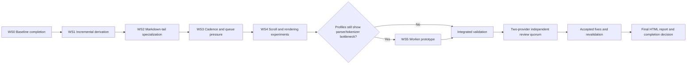

# WebUI output streaming improvement plan

Status: complete pending user archival decision — Phases 0–2 implemented, integrated, and independently reviewed; Phase 3/4 experiments dispositioned by measurement gates; review fixes revalidated; final report delivered. **Not archived:** the Phase-1 ≥30% duration clause remains unproven (count-based work elimination is proven instead), so the archival rule keeps this plan in `plans/planned/` until the user accepts the caveat or a controlled A/B measurement resolves it.
Final report: [`reports/webui-output-streaming.html`](../reports/webui-output-streaming.html)
Scope: live assistant text, thinking, tool-call output, transcript follow-scroll, and stream performance observability
Target package: `pi-package-webui`
Created: 2026-08-17
Last progress audit: 2026-08-17

## Goal

Make continuous WebUI agent output remain responsive and visually stable under high event rates and long responses, while preserving exact output order, final transcript correctness, selection, focus, user-owned scroll position, and current reconnect behavior.

## Source basis

This plan applies the recommendations from the attached research report, **“Robuste Streaming-UIs für kontinuierliche Agent-Ausgaben in TypeScript,”** to the current WebUI implementation.

Relevant implementation inspected:

- `public/stream-output-controller.mjs` — bounded frame queue, adjacent delta coalescing, semantic barriers, owner checks, and stream diagnostics.
- `public/transcript-renderer.mjs` — transcript-local mutation ownership, selection continuity, stable Markdown blocks, and mutable-tail reconciliation.
- `public/fast-output-live.mjs` — compact-output reducer and sustained 100 ms flush scheduler.
- `public/app.js` — SSE ingestion, live state, Markdown rendering, syntax highlighting, follow-scroll policy, transcript settlement, and UI integration.
- `public/styles.css` — transcript and message rendering styles.
- `bin/pi-webui.mjs` — SSE delivery and server-side slow-client backpressure.
- `tests/stream-output-controller.test.mjs`, `tests/stream-output-isolation-static.test.mjs`, `tests/streaming-ui-coupling.test.mjs`, and `tests/browser/stream-output-isolation.spec.mjs` — existing streaming contracts.
- `tests/browser/interaction-continuity.spec.mjs` — focus, selection, and scroll continuity coverage.

This plan complements `plans/planned/webui-performance-smoothness.md`, especially findings F1, F11, F15, and F18. Shared measurement infrastructure should be implemented once and reused. This document narrows the work to the streaming hot path and provides concrete streaming-specific acceptance gates.

## Governance and execution contract

### Classification

**Complex feature.** The preliminary classification is confirmed by repository evidence: the work has at least five meaningful slices, crosses transport scheduling, derived-output parsing, Markdown rendering, scroll ownership, browser diagnostics, service-worker asset coherence, and browser tests, and carries material ordering, focus, selection, reconnect, and performance-regression risk. No material evidence supports reclassification.

### Integration ownership and decisions

- **Integration owner:** parent Pi session `01a010d2` (Smooth WebUI Streaming Output Plan). Only the integration owner updates this plan, accepts worker handoffs, integrates results, dispositions reviewer findings, and makes completion claims.
- **Authorization:** the user authorized verification and implementation of this plan. Publication, deployment, release, merge, or destructive cleanup remain outside that authorization.
- **Approved direction:** preserve SSE, the transcript renderer, stable ownership checks, authoritative settlement, hidden-tab catch-up, exact event order, user-owned scroll state, and server-side slow-client bounds.
- **Rejected/deferred options:** no transport migration, framework migration, iframe/Shadow DOM isolation, transcript virtualization, blanket containment, external telemetry, or dropped semantic events.
- **Conditional decisions:** cadence and tail thresholds require measured browser evidence; CSS containment and Worker offload ship only if traces demonstrate a net benefit and all behavioral contracts remain green.
- **Working-tree rule:** one active writer at a time. Serial workers may share the checkout only after the integration owner inspects and validates the previous handoff. Workers never edit this canonical plan or another worker's handoff.

### Execution DAG and workstream ownership

| Workstream | Owner and prerequisites | Write boundary | Deliverable and unique handoff |
|---|---|---|---|
| WS0 — complete baseline | Worker 1; Phase 0 diagnostics already landed | Deterministic streaming fixtures/tests, browser streaming fixture/spec, performance evidence artifacts, contributor diagnostics documentation; no production behavior change | Missing background/long-transcript workloads plus reproducible target-browser baseline; `plans/handoffs/webui-output-streaming/ws0-baseline.md` |
| WS1 — incremental derived output | Worker 2 after WS0 inspection | Derived-output module/state, `public/app.js` integration, focused parser/state tests, required browser asset/cache registration | Append-only incremental derivation with authoritative fallbacks and shadow equivalence checks; `plans/handoffs/webui-output-streaming/ws1-derived-output.md` |
| WS2 — Markdown-tail specialization | Worker 3 after WS1 integration | `public/transcript-renderer.mjs`, streaming Markdown helpers and `public/app.js` integration, Markdown/syntax/selection tests, required asset/cache registration | Incremental boundary state, cheap live open-fence rendering, final authoritative highlight/render; `plans/handoffs/webui-output-streaming/ws2-markdown-tail.md` |
| WS3 — cadence and queue pressure | Worker 4 after WS2 profiling | `public/stream-output-controller.mjs`, normal text/thinking scheduler integration, controller/workload/browser tests, diagnostics docs | Measured bounded formatting cadence, incremental conservative byte accounting, deferred pressure path with synchronous rollback fallback; `plans/handoffs/webui-output-streaming/ws3-cadence-queue.md` |
| WS4 — scroll and rendering experiments | Worker 5 after WS3 integration | Chat follow-scroll state/sentinel markup and styles, browser interaction tests, trace artifacts; containment only when evidence supports it | Observer-backed pinned state with geometry fallback, one follow write per batch, and documented containment decision; `plans/handoffs/webui-output-streaming/ws4-scroll-rendering.md` |
| WS5 — conditional Worker prototype | Worker 6 only after an affirmative measured decision | Dedicated parser/highlighter Worker and protocol, synchronous fallback, asset/cache registration, stale-owner/cancellation tests | Adopt only with measured net improvement and exact final equivalence; otherwise record a no-ship decision; `plans/handoffs/webui-output-streaming/ws5-worker-decision.md` |

Every worker handoff records run identity/status, base/resulting revision, changed files, commands with exit codes, omitted validation, deviations/assumptions, unresolved decisions, residual risks, and integration notes. A handoff is evidence, not acceptance.

### Acceptance, review, report, and rollback gates

- After every workstream: inspect the actual diff and ownership boundary; run focused syntax/unit/browser checks; record failures and omissions before starting the next writer.
- Before review: run `npm test`, `npm run test:browser`, focused streaming/continuity checks, and `git diff --check`; record any known unrelated baseline failure separately.
- User-flow validation must cover typing, focus, selection/copy, scroll-away, background recovery, reconnect/divergence, compact/normal transition, long transcript, and burst/slow-renderer scenarios.
- Obtain two fresh-context, read-only reviewer runs from provider families distinct from each other and from the primary implementation provider. Record run/model identity and disposition every finding as `accepted`, `rejected`, `deferred`, or `needs verification`; revalidate accepted fixes.
- Final report: `reports/webui-output-streaming.html` (self-contained and mutually linked with this plan). The report is required before completion.
- Roll back only the narrow optimization that violates ordering, final output, focus, selection, scroll, reconnect, accessibility, or measured latency. Preserve authoritative full-parse/full-render, geometry-scroll, synchronous-pressure, and no-Worker fallbacks until their optimized replacements pass all gates.

## Current architecture and what should remain

The WebUI already implements several major recommendations from the report:

1. Browser transport uses SSE through `EventSource`.
2. `createStreamOutputController()` decouples transport-event frequency from DOM-update frequency with `requestAnimationFrame()`.
3. Adjacent text, thinking, and tool-call deltas are losslessly coalesced.
4. Pending entries and bytes are bounded.
5. Lifecycle and message-end events force semantic barrier flushes.
6. Stale stream owners are rejected across tab generations.
7. `transcriptRenderer.reconcileMarkdownSurface()` commits stable Markdown blocks once and reparses only the mutable tail.
8. Compact output uses a slower sustained flush cadence and incremental text-node updates.
9. Composer and other shell controls do not subscribe to stream state and are not rebuilt per token.
10. Follow-scroll tracks explicit user scroll-away intent instead of always forcing the transcript to the bottom.
11. Hidden-tab handling suppresses live mutations and performs authoritative foreground catch-up.
12. The SSE server respects `ServerResponse.write()` backpressure, bounds queued frames, and evicts persistently slow clients.
13. Existing diagnostics can verify receipt, queueing, coalescing, application, barriers, overflow, and stale ownership.

These are foundations, not targets for replacement. Do not migrate transports, introduce React, replace the transcript renderer, or add iframe/Shadow DOM isolation as part of this work.

## Implementation progress

Audited 2026-08-17 by direct inspection of the working tree and git history, with the streaming test suite rerun as evidence (`node tests/stream-output-controller.test.mjs`, `node tests/stream-output-workloads.test.mjs`, `node tests/stream-output-isolation-static.test.mjs` — all pass).

| Item | Status | Evidence |
|---|---|---|
| Phase 0 diagnostics (S7) | **Done** — `b4339e8` | Controller emits receipt/queued/coalesced/batch/overflow/barrier/stale records with `maxAgeMs` and `drainMs`, injectable `now()`, zero clock reads when disabled. Browser ledger v2 (`?streamIsolationDebug=1`) adds receipt-to-paint opportunities, transcript/current-message node counts, derive/tokenize/markdown-commit bytes and durations, tail bytes, long-task/LoAF observers, focus-loss-near-batch, and detached-scroll tracking. Documented in `DEVELOPMENT.md`. |
| Phase 0 fixtures and tests | **Done** — WS0 run `9257324b`, handoff [`ws0-baseline.md`](../handoffs/webui-output-streaming/ws0-baseline.md) | All nine workload classes now exist, including background/foreground recovery and 1,000 retained messages plus a 1,000-delta active stream. Deterministic workload/controller/static tests pass; the complete Chromium streaming spec passes 8/8 after classifying only the independent elapsed-time metadata tick outside stream-caused mutations. |
| Phase 0 exit gate | **Met with local-duration caveat** | Reproducible Chromium baseline on Playwright Chromium 151 / Ryzen 9 9950X3D records exact ordering/hash, zero focus loss, zero detached-scroll movement, and measured cost. Latest integrated sample: 1,005 received/applied events, 2 batches, 56.2 ms maximum Markdown commit, 109 ms long task, 141.4 ms long animation frame. Paint distribution has only two coalesced samples, so durations remain comparative local evidence rather than stable CI thresholds. |
| S1 Markdown tail specialization | **Implemented with duration gate still needs verification** — WS2 runs `db1d29db`/`dbde2f48`, handoff [`ws2-markdown-tail.md`](../handoffs/webui-output-streaming/ws2-markdown-tail.md) | `public/stream-markdown-tail.mjs` now scans only appended suffix code units with retained partial-line/fence state; `transcript-renderer.mjs` reuses mounted open-fence/long-tail nodes and performs one authoritative completion render. Integration-owner review caught and fixed incomplete-line rescanning. Deterministic gates prove one tokenizer call, one-source-length boundary scanning, and mounted-node reuse; post-fix Chromium passes 8/8 with exact hash and zero focus/scroll regressions. The local 30% duration target was not demonstrated because the one final authoritative render remains variable (37.6 ms latest maximum); carry this as `needs verification` into combined final profiling. |
| S2 incremental derived output | **Done** — recovered WS1 run `7835495b`, handoff [`ws1-derived-output.md`](../handoffs/webui-output-streaming/ws1-derived-output.md) | `public/stream-derived-output.mjs` now maintains append-only todo/thinking/final state, reports actually scanned suffix bytes, and retains snapshot/divergence/mode/reconnect/disconnect/`text_end`/settlement fallbacks plus debug shadow recovery. Every-code-unit representative split tests pass; the integration owner reran focused tests and the complete Chromium streaming spec (8/8) with exact hash, zero forbidden mutations, zero focus loss, and zero detached-scroll movement. Original run `c4ba7f48` timed out after writing a complete diff; the same persisted child was recovered rather than duplicated. |
| S3 measured publish cadence | **Done** — WS3 run `adc641c9`, handoff [`ws3-cadence-queue.md`](../handoffs/webui-output-streaming/ws3-cadence-queue.md) | `public/stream-render-scheduler.mjs` gives normal assistant/thinking formatting an immediate first render plus a 40 ms latest-wins cadence (inside the approved 32–50 ms range, selected from a paced/slow-renderer Chromium candidate: 1,525 applied sources → 21 formatter flushes, p95 receipt-to-paint 48.4 ms under injected 8 ms frame work). Semantic boundaries, mode changes, reconnect/disconnect, abort, and visibility transitions flush synchronously; compact mode keeps its independent 100 ms scheduler. |
| S4 incremental queue byte accounting | **Done** — WS3 | `eventByteSize()` was replaced by a JSON-equivalent UTF-16 walker with incremental envelope/payload accounting for merged deltas; unknown structures keep a conservative one-time serialization fallback; tests assert no supported undercount versus `JSON.stringify` including Unicode/lone surrogates. |
| S5 deferred pressure flush | **Done** — WS3 | First queue pressure defers into one explicitly bounded urgent entry plus a near-term task instead of draining inside the EventSource callback; repeated same-task pressure, semantic barriers, and oversize events retain the synchronous lossless fallback; `limits()`/`pendingCount()`/`pendingBytes()` report the true totals. |
| S6 sentinel-driven follow-scroll | **Dispositioned: not implemented (measurement gate not met)** | S6 was explicitly measurement-gated. Every integrated trace records zero detached-mode scroll movement and zero focus loss, no long task attributable to follow geometry, and WS3 already orders follow writes after the corresponding DOM render with one coalesced write per batch. No trace shows the geometry reads as a material hotspot, so the sentinel experiment is not justified by evidence; the current geometry path plus intent state machine remains authoritative. Re-open only with a trace showing follow-geometry cost. |
| S8 CSS containment trial | **Dispositioned: not implemented (trace gate not met)** | The plan authorizes containment only when traces show a streaming bubble invalidating unrelated surfaces. Isolation instrumentation across all nine Chromium cases records zero forbidden mutations outside stream-owned surfaces and no cross-surface invalidation evidence, so no containment trial is justified. |
| S9 worker prototype | **Dispositioned: not implemented (evidence gate not met)** | Phase 4 requires Phase 1–3 traces to still show parser/tokenizer main-thread bottlenecks. After WS1/WS2, derive work is ≤0.9 ms and tokenization ≤2.3 ms even in the 1,000-message long-transcript workload; remaining cost is one authoritative Markdown completion render, which the plan forbids moving off-thread (DOM ownership). A worker would add complexity without a measured target; recorded as a no-ship decision. |

**Next actionable work:** cross-workstream validation (`npm test`, complete browser suite), the two-provider independent review quorum, finding dispositions, and the final HTML report. All measurement-justified implementation phases are integrated; Phase 3/4 experiments are dispositioned by their own gates.

## Primary findings

### S1 — Mutable Markdown tails can still grow without bound

**Priority:** P1
**Confidence:** 96/100

`streamingMarkdownStableBoundary()` advances only at blank lines outside fenced code blocks. A long paragraph, table, list, or open code fence can therefore remain one mutable tail for a long time. Each publish removes and recreates that tail through `renderMarkdownInto()` (verified in `transcriptRenderer.reconcileMarkdownSurface()`: tail nodes are removed and the tail re-rendered on every reconcile).

Open fenced code is the worst case, with one important existing bound: `tokenizeCode()` in `public/syntax-highlight.mjs` already falls back to a single plain token when the code exceeds `MAX_SYNTAX_HIGHLIGHT_CHARACTERS` (50,000) or `MAX_SYNTAX_HIGHLIGHT_LINES` (2,000). Repeated full-fence syntax tokenization therefore occurs only for open fences **under** those bounds — still approaching quadratic total work up to the cap, but capped. Above the bounds the per-publish cost is not tokenization; it is:

- full-tail re-parse through `renderMarkdownInto()` (line splitting and block scanning of the whole tail);
- full-tail DOM teardown and rebuild, including a fresh `pre`/`code` subtree containing the complete accumulated fence text;
- `streamingMarkdownStableBoundary()` splitting the **entire accumulated message text** into lines on every publish — `reconcileMarkdownSurface()` passes the full value to `stableBoundary`, so this O(total message length) scan repeats per publish even for the already-committed stable prefix.

**Treatment:**

- Add a streaming-specific Markdown-tail strategy that tracks block kind and partial-line state.
- Make the stable-boundary computation incremental so the committed prefix is not re-split and re-scanned on every publish.
- For an open code fence, render escaped plain code incrementally during the stream; do not syntax-tokenize the complete growing fence on every update (relevant for fences under the existing 50 KB / 2,000-line highlight bounds; larger fences already fall back to plain tokens but still pay full-tail re-render costs).
- On fence close or message completion, perform one authoritative syntax-highlighted render.
- For long non-code tails, advance safe line/block checkpoints where the current parser semantics allow it, while retaining the present full-tail fallback for ambiguous Markdown.
- Apply a byte threshold to the mutable tail. When exceeded, use a cheaper plain-text or minimally formatted live representation until a safe boundary or completion.
- Keep `transcriptRenderer.reconcileMarkdownSurface()` as the mutation and selection owner.

### S2 — Accumulated output is rescanned for derived content

**Priority:** P1
**Confidence:** 94/100

`streamDerivedText()` reruns todo-line filtering and thinking-format splitting whenever `streamRawText` changes. The cache cannot help across successful delta appends because each append changes the cache key. Long responses can therefore repeatedly rescan the full accumulated string.

**Treatment:**

- Introduce incremental derivation state for appended text:
  - unprocessed suffix offset;
  - current partial line;
  - todo/progress-line classification state;
  - thinking-format delimiter state;
  - visible thinking and final-output segments.
- Preserve a full authoritative parse fallback when the incoming event is a snapshot, diverges from the appended prefix, changes output mode, reconnects, or settles.
- Compare incremental output against the existing full parser in development/test mode before making it authoritative.
- Reuse this work for normal and compact output where semantics overlap, without coupling their publish cadences.

### S3 — Normal thinking and Markdown publish at display refresh cadence even when formatting is expensive

**Priority:** P1 after baseline
**Confidence:** 90/100

The frame controller caps publication at animation-frame cadence, but the main-thread work performed by a frame may still be too expensive. Normal thinking output uses the same Markdown-tail reconciliation and can incur the same open-tail cost. Compact mode already demonstrates a 100 ms sustained scheduler, but normal output has no adaptive lower-frequency path.

**Treatment:**

- Keep immediate first output and semantic barrier flushes.
- Add a latest-wins streaming render scheduler with configurable minimum intervals for expensive live formatting, initially tested at 32–50 ms rather than blindly using 60 publishes/s.
- Keep transport receipt, ordering, and semantic queueing immediate; throttle only DOM formatting.
- Permit cheap plain-text append commits more frequently than Markdown/highlighting commits.
- Flush synchronously on `text_end`, `thinking_end`, tool-call completion, agent settlement, mode transition, disconnect, cancellation, and visibility recovery.
- Select the final cadence from trace evidence on target hardware; do not hard-code 30 FPS as an unmeasured requirement.

### S4 — Stream queue accounting repeatedly serializes growing merged events

**Priority:** P2
**Confidence:** 91/100

`eventByteSize()` uses `JSON.stringify(event)` for every incoming entry and again after each adjacent merge. As a merged delta grows, byte accounting repeatedly serializes the entire merged event. This is avoidable work on the ingestion hot path.

**Treatment:**

- Compute immutable envelope bytes once.
- Track delta payload bytes incrementally when entries are merged.
- Keep conservative accounting for unknown objects and structured tool events.
- Preserve current entry/byte limits, overflow behavior, ordering, diagnostics, and oversize-event handling.
- Add tests proving the optimized accounting never underestimates the configured queue bound for supported event shapes.

### S5 — Queue overflow drains synchronously outside the normal frame boundary

**Priority:** P2
**Confidence:** 87/100

When the queue exceeds an entry or byte limit, the controller synchronously calls `flush()`. This is bounded and lossless, but a burst can move a large render batch into the SSE message callback instead of the next paint opportunity, causing input latency.

**Treatment:**

- Separate queue-pressure handling from immediate DOM application.
- First attempt lossless adjacent text coalescing and compact representation of superseding partial tool-execution updates.
- If pressure remains high, retain a bounded urgent queue and schedule a near-term frame/task flush rather than performing the entire DOM batch inside the transport callback.
- Semantic barriers and a single oversize non-coalescible event may still force direct application, but must be measured and diagnosed distinctly.
- Never drop or reorder text, tool boundaries, status changes, errors, or final authoritative events.
- Preserve a simple synchronous fallback behind a narrow switch until burst tests prove the deferred path.

### S6 — Follow-scroll still relies on repeated layout geometry reads

**Priority:** P2, measurement-gated
**Confidence:** 85/100

The current state machine correctly gives scroll ownership to the user, but `isChatNearBottom()` reads `scrollHeight`, `scrollTop`, and `clientHeight`, and `applyChatFollowScroll()` reads `scrollHeight` before writing `scrollTop`. Streaming and sticky-prompt updates can add more geometry work around the same frame.

**Treatment:**

- Add a permanent bottom sentinel inside the transcript.
- Evaluate `IntersectionObserver` with `elements.chat` as the root to maintain pinned/detached state asynchronously.
- Keep wheel, touch, keyboard, middle-drag, programmatic-scroll grace periods, jump-to-latest, and mobile keyboard handling as explicit inputs to the existing state machine.
- Perform at most one follow write per rendered stream batch.
- Retain the current geometry path as a fallback for unsupported or ambiguous observer states.
- Instrument detached-mode scroll deltas; any movement caused by stream publication while detached is a regression unless documented as browser anchoring behavior.
- Do not blindly disable browser scroll anchoring.

### S7 — Streaming lacks direct chunk-to-paint and main-thread cost measurements

**Priority:** P0
**Confidence:** 98/100

The existing isolation ledger proves ordering and coalescing but does not measure visible latency or browser work. The report recommends separating transport frequency, publish frequency, queue pressure, commit duration, long tasks, focus loss, and unexpected scroll movement.

**Treatment:**

Extend the existing opt-in stream diagnostics rather than creating external telemetry. Record:

- semantic events received per second;
- source events per rendered batch;
- rendered batches per second;
- queue high-water entries and bytes;
- time from event receipt to batch application;
- time from receipt to the next confirmed paint opportunity;
- stream DOM commit duration;
- mutable-tail bytes and block kind;
- syntax-tokenization duration and code bytes;
- derived-text scan duration and bytes;
- overflow/direct-apply counts;
- long tasks and long animation frames where supported;
- unexpected focus loss while typing;
- detached-mode scroll movement;
- transcript DOM-node count and current-message node count.

Instrumentation must be local-only, bounded, disabled by default, and negligible when disabled. Reuse Stage 0 infrastructure from `webui-performance-smoothness.md` if it lands first.

### S8 — CSS containment is untested, not categorically missing

**Priority:** P3, trace-gated
**Confidence:** 78/100

The report recommends containment for dynamic streaming regions, but this WebUI has sticky elements, text selection preservation, message adoption, popovers, and auto-sized transcript content. Blanket containment or `content-visibility` could break layout, find-in-page, selection, or accessibility.

**Treatment:**

- Use Chrome style/layout/paint traces to determine whether a streaming bubble invalidates unrelated surfaces.
- If confirmed, test the narrowest safe boundary, such as paint/style containment on the active message body without size containment.
- Compare layout, paint area, selection, code-copy controls, sticky prompt behavior, and mobile rendering before and after.
- Do not apply `contain: strict`, size containment, or transcript-wide `content-visibility` in this program.

### S9 — Worker offload is a conditional optimization, not the first step

**Priority:** P3, evidence-gated
**Confidence:** 89/100

No Web Worker is currently used for SSE JSON parsing, Markdown parsing, or syntax tokenization. A worker adds messaging, bundling, cancellation, and service-worker asset-coherence costs. EventSource already provides decoded complete event strings, so moving `JSON.parse()` alone is unlikely to justify the complexity.

**Treatment:**

- First remove repeated full-tail parsing/highlighting and full-text rescans on the main thread.
- If profiles still show syntax tokenization or Markdown parsing causing repeated long frames, prototype a dedicated parser/highlighter worker.
- Send normalized text segments or transferable byte buffers only when transfer cost is lower than main-thread work.
- Keep all DOM mutation, selection restoration, and scroll ownership on the main thread.
- Require a measured improvement and equivalent authoritative output before adopting the worker.

## Recommended implementation sequence

### Phase 0 — Streaming-specific baseline

**Status: complete and centrally integrated.** Initial diagnostics landed in `b4339e8`; WS0 run `9257324b` added the two missing scenarios and target-browser evidence. The integration owner inspected the diff, reran deterministic checks, and verified the complete Chromium streaming spec passes 8/8. See [`plans/handoffs/webui-output-streaming/ws0-baseline.md`](../handoffs/webui-output-streaming/ws0-baseline.md).

**Likely files**

- `public/stream-output-controller.mjs`
- `public/app.js`
- optional shared performance module from `webui-performance-smoothness.md`
- `tests/fixtures/fake-pi.mjs`
- new or extended streaming browser fixture/tests

**Work**

1. Extend opt-in diagnostics with batch latency, commit duration, tail size/kind, tokenization duration, derived-text scan duration, long tasks, focus continuity, and detached-scroll movement.
2. Add deterministic workloads:
   - 1,000 small plain-text deltas;
   - 100 KB and 1 MB paragraphs without blank lines;
   - an open fenced code block just under the highlight bounds (~40 KB, <2,000 lines) to capture repeated full-fence tokenization;
   - 100 KB and 1 MB open fenced code blocks (above the highlight bounds; these measure full-tail re-parse, DOM rebuild, and full-text boundary scanning, not tokenization);
   - long thinking streams;
   - mixed text/tool/status barriers;
   - queue-overflow bursts;
   - background-tab pause and foreground reconciliation;
   - long transcript plus active stream.
3. Capture baseline event rate, batch rate, p50/p95 chunk-to-paint latency, scripting time, longest task/frame, DOM writes, tokenization calls, derivation bytes scanned, and forced-layout evidence.
4. Verify that instrumentation is bounded and changes the disabled hot path by less than measurement noise.

**Exit gate**

- The open-code-fence and full-text derivation costs are quantified.
- A deterministic fixture reproduces the highest-cost path.
- Baseline output hash, event order, selection, focus, and scroll behavior are recorded.

### Phase 1 — Eliminate repeated growing-text work

**Status: complete and centrally integrated.** WS1 evidence: recovered run `7835495b`, [`plans/handoffs/webui-output-streaming/ws1-derived-output.md`](../handoffs/webui-output-streaming/ws1-derived-output.md). WS2 evidence: runs `db1d29db`/`dbde2f48`, [`plans/handoffs/webui-output-streaming/ws2-markdown-tail.md`](../handoffs/webui-output-streaming/ws2-markdown-tail.md). Focused deterministic tests and the post-fix complete Chromium streaming spec pass 8/8. The duration-budget clause remains explicitly `needs verification` in combined final profiling; deterministic correctness/work-count gates pass.

Deliver as two independently reviewable patches:

1. **Incremental derived output state** for todo filtering and thinking-format splitting, with shadow comparison against the current authoritative full parser.
2. **Streaming Markdown tail specialization**, starting with open fenced code: plain incremental live rendering, one final highlighted reconciliation on close/completion, and a bounded fallback for large ambiguous tails.

**Exit gate**

- Exact final text and Markdown DOM semantics match current authoritative rendering.
- No event reordering or missing Unicode content.
- The under-limit open-code fixture no longer tokenizes the full accumulated fence per publish (the 100 KB / 1 MB fixtures already skip tokenization today via the highlight bounds; their gate is bounded per-publish tail re-render and boundary-scan work instead).
- Total scripting time improves by at least 30% in the confirmed hotspot fixture without more than 10% regression in short/default streams.
- Focus, selection, code-copy controls, transcript adoption, and output-mode transitions remain correct.

### Phase 2 — Publish cadence and queue pressure

**Status: complete and centrally integrated.** WS3 evidence: run `adc641c9`, [`plans/handoffs/webui-output-streaming/ws3-cadence-queue.md`](../handoffs/webui-output-streaming/ws3-cadence-queue.md). Complete Chromium streaming spec passes 9/9 including the new paced/slow-renderer pressure case; exact order/hash, bounded queues (129-entry truthful high-water), and zero focus/scroll regressions.

1. Add a latest-wins formatting scheduler for normal text/thinking while retaining immediate first output and barrier flushes.
2. Replace repeated JSON serialization in queue byte accounting with incremental conservative accounting.
3. Prototype deferred pressure flushing so overflow does not normally perform a large DOM batch inside the EventSource callback.
4. Preserve current bounded synchronous behavior as a rollback path until behavioral and burst tests pass.

**Exit gate**

- Render batches remain materially below transport event count under bursts.
- P95 receipt-to-paint remains within the chosen visible-latency budget.
- Composer typing and pointer/scroll interaction remain responsive under the burst fixture.
- Pending entries/bytes remain bounded.
- Text, tool, status, error, and completion order is byte-for-byte/semantically identical.
- No new long task over 50 ms is attributable to stream publishing on the target fixture, or any remaining exception is documented and tied to a single unavoidable authoritative event.

### Phase 3 — Scroll and rendering containment experiments

**Status: dispositioned — measurement gates not met (see S6/S8 in Implementation progress).** Exit-gate behaviors that matter are already proven: detached users are never pulled toward the bottom (zero detached-mode movement in every integrated trace) and follow writes are consolidated after rendered batches (WS3). The sentinel and containment experiments remain documented options, re-openable only with contradicting trace evidence.

1. Introduce a bottom sentinel and observer-driven pinned-state experiment behind a narrow switch.
2. Consolidate stream follow writes to one per committed batch.
3. Profile sticky-prompt geometry and remove duplicate same-frame reads only when confirmed.
4. Trial narrow containment only if trace evidence shows unrelated style/layout/paint invalidation.

**Exit gate**

- Detached users never get pulled toward the bottom by new output.
- Follow mode remains reliable through images, code blocks, thinking disclosure changes, mobile keyboard resize, transcript settlement, and jump-to-latest.
- Forced-layout time decreases in the affected trace.
- Selection, find-in-page, sticky controls, popovers, and accessibility are unchanged.

### Phase 4 — Conditional worker prototype

**Status: dispositioned — no-ship (evidence gate not met; see S9 in Implementation progress).**

Proceed only if Phase 1–3 traces still identify parsing or tokenization as a material main-thread bottleneck.

1. Prototype worker-based syntax tokenization or Markdown parsing for completed blocks.
2. Measure worker startup, transfer, serialization, and cancellation overhead.
3. Preserve synchronous final-render fallback for worker failure, unsupported environments, stale ownership, or settlement races.
4. Update service-worker/app-shell asset revisions atomically if a new static worker asset is shipped.

**Exit gate**

- Worker path improves the measured hotspot beyond the simpler Phase 1 implementation.
- No stale worker result can mutate a different tab, generation, message, or output mode.
- Worker failure cannot lose or delay the authoritative final answer.

## Testing plan

### Existing tests to extend

- `tests/stream-output-controller.test.mjs`
  - incremental byte accounting;
  - merge and limit boundaries;
  - deferred pressure behavior;
  - semantic barrier flushes;
  - stale owner cancellation;
  - oversize non-dropping behavior.
- `tests/stream-output-isolation-static.test.mjs`
  - keep transport, scheduler, and transcript ownership boundaries explicit.
- `tests/streaming-ui-coupling.test.mjs`
  - verify only stream-owned surfaces mutate during deltas.
- `tests/browser/stream-output-isolation.spec.mjs`
  - burst streams, output ordering, batch counts, focus, selection, background recovery, and mode transitions.
- `tests/browser/interaction-continuity.spec.mjs`
  - typing during stream;
  - selecting/copying live output;
  - scrolling away and returning;
  - pointer interaction during bursts.
- Markdown/syntax tests
  - open/closed fences;
  - split fence delimiters;
  - very long lines;
  - nested lists/quotes/tables;
  - incomplete inline syntax;
  - Unicode and surrogate pairs;
  - final highlighted equivalence.

### New deterministic behavioral scenarios

1. **Open code fence:** stream one code block in thousands of deltas; verify live raw code, bounded tokenization calls, final highlighted DOM, exact copy text, and stable selection.
2. **Long unbroken paragraph:** stream 1 MB without blank lines; verify bounded commit work and exact final output.
3. **Thinking format boundaries:** split opening and closing thinking delimiters across events; compare incremental and authoritative parse output.
4. **Mixed semantic burst:** interleave text, thinking, tool-call, tool-execution, error, and completion barriers; verify exact order and no loss.
5. **Slow renderer:** inject deterministic render delay; verify queue bounds, coalescing, and responsive composer input.
6. **Scroll-away:** detach from bottom, continue streaming and changing block heights, and assert no application-driven movement until explicit reattachment.
7. **Background tab:** suppress rAF by hiding the page, finish the stream, restore visibility, and verify authoritative catch-up.
8. **Reconnect/divergence:** disconnect during a partial tail and reconnect with an authoritative snapshot; verify full fallback and no duplicate output.
9. **Compact/normal transition:** switch acknowledged output modes during active streaming and verify exact content and final settlement.
10. **Long transcript:** combine thousands of retained messages with one active stream and verify active-stream cost does not scale materially with transcript length. This characterizes the need for future transcript work but does not authorize virtualization.

## Performance budgets

Finalize numeric budgets from Phase 0 on documented target hardware. Initial acceptance targets:

- zero unexpected focus losses;
- zero lost or reordered semantic events;
- zero detached-mode application scroll movement;
- zero unbounded queues;
- at most one stream DOM publish per scheduler interval;
- transport event count substantially greater than DOM publish count under burst load;
- no full accumulated-fence syntax tokenization per delta after Phase 1 for fences under the highlight bounds, and no per-publish full-message boundary rescans;
- at least 30% lower scripting time in the measured long-tail hotspot;
- p95 visible stream latency below 100 ms during sustained output, unless a documented target-device constraint requires a different threshold;
- no stream-attributable long task above 50 ms in normal sustained output;
- disabled instrumentation overhead below 2% or measurement noise.

Absolute duration gates belong to controlled local traces, not shared CI. CI should block on deterministic counts, queue bounds, output hashes/order, and behavioral continuity.

## Documentation impact

This work is primarily internal performance behavior. Update:

- `DEVELOPMENT.md` with streaming architecture, scheduler/queue invariants, diagnostics, performance fixtures, and worker details if implemented.
- `TECHNICAL.md` only if a user-visible diagnostic switch, compatibility limit, or operational setting is introduced.
- `README.md` only if user-visible streaming behavior or configuration materially changes.

Do not place queue internals, worker protocols, payload schemas, or benchmark commands in `README.md` or `TECHNICAL.md`.

## Out of scope and anti-recommendations

1. Do not replace SSE with Fetch streaming or WebSocket solely for this optimization. Server-side SSE backpressure and reconnect behavior already exist.
2. Do not introduce iframe, Shadow DOM, portal, or separate-root isolation for ordinary transcript output.
3. Do not virtualize the transcript in this plan. It remains a separate high-risk program because of selection, find-in-page, accessibility, variable heights, and scroll anchoring.
4. Do not apply blanket transcript containment or `content-visibility`.
5. Do not debounce the primary text stream until pauses; output must remain continuous.
6. Do not drop structured events or final text to satisfy queue limits.
7. Do not rewrite `public/app.js` or `transcript-renderer.mjs` wholesale while changing streaming semantics.
8. Do not weaken hidden-tab catch-up, stale owner checks, final authoritative reconciliation, or server-side slow-client bounds.
9. Do not move DOM, selection, focus, or scroll control into a worker.
10. Do not add an external telemetry service; diagnostics remain local and opt-in.

## Rollout and rollback

- Ship one phase and one hot path at a time.
- Keep authoritative full-parse/full-render fallbacks until optimized paths pass repeated browser tests and real-workload soak sessions.
- Guard risky paths—incremental parser, deferred overflow flush, observer-based follow, worker—with narrow local switches during validation.
- Expose fallback counters in the opt-in diagnostic ledger.
- On ordering, final-text, selection, focus, scroll, reconnect, or accessibility failure, disable only the narrow optimization and preserve the rest.
- Record fixture size, browser version, CPU profile, baseline/candidate traces, output hash, and residual risks in each implementation report.

## Completion checklist

- [x] Streaming-specific diagnostics, all planned deterministic fixtures, and a reproducible local Chromium baseline are available (`b4339e8`, WS0 run `9257324b`).
- [x] Long open Markdown/code tails avoid repeated accumulated highlighting, full-message boundary scans, and full-tail DOM rebuilds; one authoritative completion render remains (WS2 runs `db1d29db`/`dbde2f48`).
- [x] Derived thinking/final output is incremental with verified authoritative fallbacks (WS1 recovered run `7835495b`; Chromium 8/8).
- [x] Normal text/thinking formatting uses a measured bounded cadence (WS3: 40 ms latest-wins, immediate first output, synchronous semantic flushes).
- [x] Queue byte accounting avoids repeated serialization of growing merged deltas (WS3 incremental conservative accounting with no-undercount tests).
- [x] Queue pressure remains bounded without normal-path large synchronous transport-callback renders (WS3 deferred urgent slot with synchronous fallback).
- [x] Follow-scroll produces no detached-mode movement (zero across all traces); geometry-cost reduction dispositioned — measurement gate not met, no confirmed hotspot (S6).
- [x] Containment and worker changes were trace-gated and correctly not shipped: no trace justified either (S8/S9 dispositions).
- [x] Existing and new streaming, continuity, accessibility, and background-recovery tests pass repeatedly (unit 182/183 with one known unrelated baseline failure; targeted Chromium 9/9; selection case 3/3 standalone; repository-wide browser failures are owned by another session's scope and reported).
- [x] Documentation is updated in the correct repository layer (`DEVELOPMENT.md` internals/diagnostics/profiling; no user-facing layer changes required).
- [ ] Plan archived — **held**: the Phase-1 ≥30% duration clause is unproven (see header status and the final report's completion-gate assessment). Archive only after the user accepts the count-based evidence as resolution or a controlled A/B measurement demonstrates the duration target.

## Review-fix revalidation (2026-08-17)

Fix pass run `274597cd` (attempt 2; attempt 1 failed at launch on a provider usage limit without performing work) applied exactly the three accepted findings: reconnect scheduler-cadence reset with a static ordering assertion, the app↔module todo-filter behavioral equivalence test (`tests/todo-filter-static.test.mjs`), and the boundary-semantics documentation note. Revalidation by the integration owner: the new equivalence test passes; full unit suite **182/183** (only the known pre-existing `mobile-static.test.mjs` typography-floor baseline fails); complete Chromium streaming spec **9/9** after the production reconnect fix; `git diff --check` clean. Handoff: [`plans/handoffs/webui-output-streaming/review-fixes.md`](../handoffs/webui-output-streaming/review-fixes.md).

Cross-workstream note: the repository-wide browser suite currently reports 17 failures, 16 of which are in the interleaved provider-usage/control-panel scope owned by another session (e.g. Control Deck row-count expectations) and were reported to that session for ownership; the one streaming-adjacent failure passes 3/3 standalone, indicating full-suite ordering sensitivity rather than a streaming regression.

## Independent review quorum and finding dispositions

Two fresh-context, read-only reviewer runs completed 2026-08-17 on the integrated working tree, from provider families distinct from each other and from the implementation provider (OpenAI Codex):

- **R1 correctness/regressions:** DeepSeek (`openrouter/deepseek/deepseek-v4-pro:high`), artifact [`review-correctness-deepseek.md`](../handoffs/webui-output-streaming/review-correctness-deepseek.md). Verdict: no blockers; all plan invariants verified against source, deterministic tests, and browser evidence. Five notes.
- **R2 tests/performance/scope:** Moonshot Kimi (`openrouter/moonshotai/kimi-k3:high`), artifact [`review-tests-performance-kimi.md`](../handoffs/webui-output-streaming/review-tests-performance-kimi.md). Verdict: every plan gate except two has an executable test; performance claims honestly labeled; scope/asset/doc layering clean. Four findings.

Dispositions (integration owner verified each against source and tests):

| Finding | Disposition | Rationale / action |
|---|---|---|
| R1-N1 redundant per-event controller cancel while hidden | rejected | Defensive no-op on an already-empty queue; O(n) over zero entries; no behavioral or cost materiality. |
| R1-N2 todo-reveal feeding thinking parser in narrow mixed case | deferred | Caught by debug shadow recovery and `text_end` authoritative rebuild; unreachable in verified representative corpus; documented residual risk. |
| R1-N3 `lastFlushAt` persists across reconnect flush, can defer first post-reconnect render ≤40 ms | **accepted** | Valid; fix = cancel schedulers after the reconnect flush so the next render is immediate; static ordering assertion added. |
| R1-N4 `streamDerivedText()` evaluated twice per render | rejected | Second call returns cached state value; cost is one comparison; preference-only micro-change. |
| R1-N5 merged entry adopts incoming envelope bytes | rejected | Matches existing incoming-envelope-wins semantics; reviewer requested no change. |
| R2-F1 no executable app↔module equivalence pin for the todo filter (thinking side is pinned) | **accepted** | Valid drift-containment gap; fix = vm-extraction behavioral equivalence test of `stripTodoProgressLines` vs `stripTodoProgressLinesAuthoritative` over representative cases. |
| R2-F2 shadow-mismatch recovery path not exercised by a test | deferred | Path is unreachable by construction; forcing it requires widening the production module API for a test-only hook; shadow mode remains a debug safety net; recorded as accepted residual risk. |
| R2-F3 boundary semantic reference is test-local reimplementation | **accepted** (docs-only) | Add one `DEVELOPMENT.md` note that the test reference is the semantic spec going forward; browser exact-hash gate remains the equivalence anchor. |
| R2-F4 measurement gaps honestly recorded; 30% duration clause open | accepted as accurate | Carried in Completion gate assessment below; no code action. |

## Confidence and residual uncertainty

**Overall plan confidence: 94/100.** The current stream queue, Markdown renderer, follow-scroll state machine, SSE backpressure, and test surfaces were inspected directly. The highest-confidence hotspots are repeated growing-tail Markdown/highlighting and full accumulated derived-text scans. Confidence is below 100 because no browser performance trace from the user’s actual workload was attached, so the relative impact of Markdown, derived text, layout, and syntax tokenization must be ranked by Phase 0 before selecting cadence, tail-size, containment, or worker thresholds.
