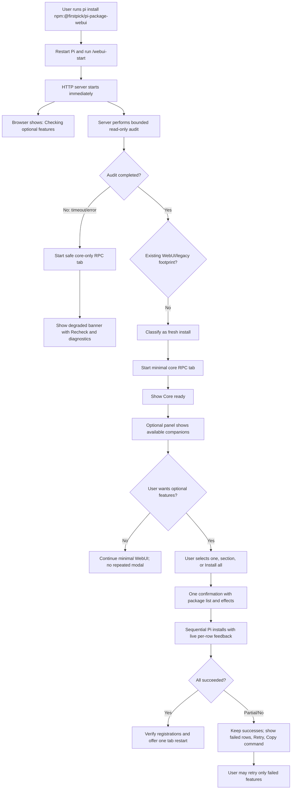
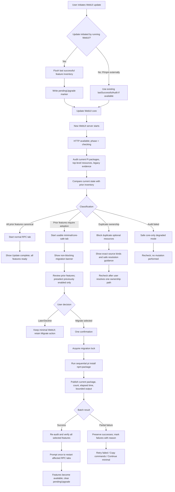
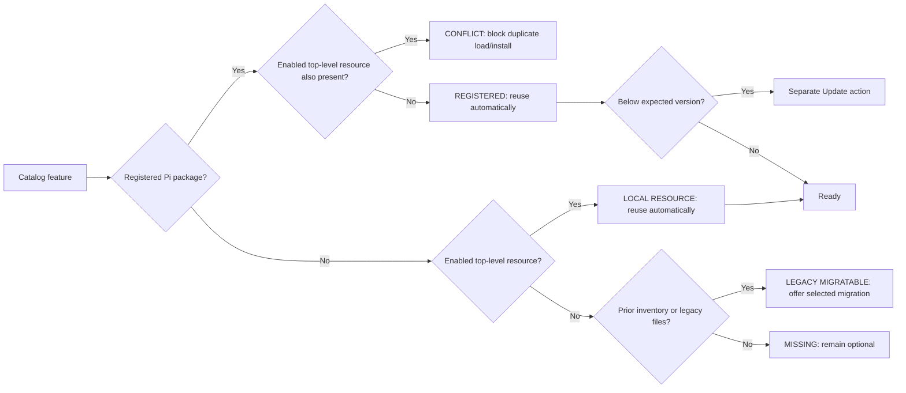
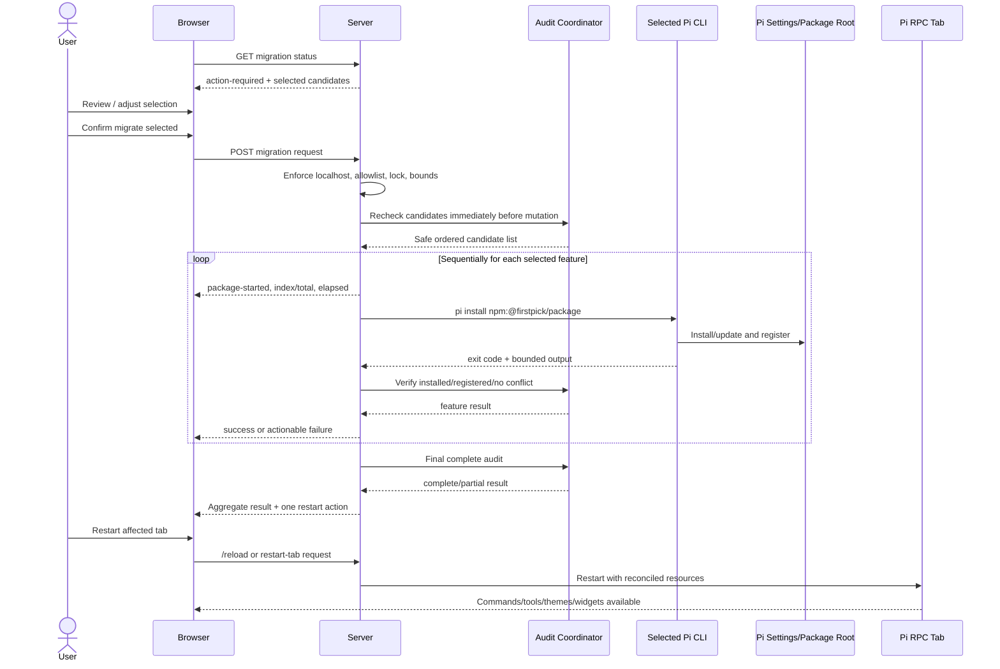

# Complex Feature Plan: WebUI Optional-Feature Startup Audit and Migration

**Status:** Planned; implementation not started.

**Date:** 2026-08-04

**Goal:** Preserve a minimal `@firstpick/pi-package-webui` core while making fresh installs and upgrades reliable, understandable, and low-friction. Every server start performs a bounded read-only audit; existing valid resources are reused automatically; mutations remain explicitly confirmed; migration progress and recovery are visible at all times.

**Classification:** Complex. The feature crosses server startup ordering, Pi package/resource resolution, update migration, persistent state, browser UX, security boundaries, failure recovery, and compatibility with older WebUI package layouts. It requires at least two independently verifiable implementation slices.

**Integration owner:** Parent Pi agent. Only the integration owner updates this plan, accepts worker outcomes, integrates shared files, dispositions reviewer findings, and archives the plan after every completion gate passes.

**Final report:** To be created at [`../../pi-package-webui/reports/webui-optional-feature-startup-audit-and-migration.html`](../../pi-package-webui/reports/webui-optional-feature-startup-audit-and-migration.html).

## 1. Recommended implementation

Implement a two-layer design:

1. **Automatic, read-only startup reconciliation** on every WebUI server process start.
2. **Interactive, explicitly confirmed migration** only when package/settings mutations are required.

The HTTP control plane becomes available immediately. The initial Pi RPC tab waits for the bounded audit. Browser clients consume server-owned audit state and never initiate independent filesystem scans. Existing Pi packages and enabled top-level resources are reused without prompting. Legacy WebUI-bundled companions are treated only as migration evidence; they are not loaded from the old WebUI `node_modules` tree.

### Recommended policy

| Situation | Default behavior | User interaction |
|---|---|---|
| Independently registered Pi package | Reuse automatically | None |
| Enabled top-level extension/skill/prompt/theme | Reuse automatically | None |
| Legacy WebUI-bundled package files only | Mark migratable; do not load from legacy path | One review + confirmation |
| Previously available feature now pruned by update | Offer restoration from the previous audit/inventory | One review + confirmation |
| Missing optional feature on a fresh install | Keep minimal core; show optional action | None unless user chooses Install |
| Package and top-level resource both enabled | Mark conflict; prevent duplicate loading/install | Actionable conflict resolution |
| Audit fails or exceeds its startup deadline | Start safe core-only RPC mode; retain HTTP diagnostics | Retry/Recheck action |
| Unattended deployment | No migration by default | Explicit CLI opt-in only |

## 2. Success criteria

1. Every server start performs one bounded, read-only optional-feature audit before spawning the first normal RPC tab.
2. The HTTP server remains available during audit and exposes a truthful phase: `checking`, `ready`, `action-required`, `migrating`, `partial`, `complete`, or `degraded`.
3. Fresh installs start minimal and do not present a blocking migration dialog.
4. Existing independently registered packages and enabled top-level resources continue working without reinstallation or duplicate registration.
5. Updates from bundled-feature versions identify the prior feature set from a persisted pre-update inventory when available, with safe legacy heuristics as fallback.
6. Migration never runs automatically by default. One confirmation covers the selected batch; installs run sequentially through the selected Pi CLI.
7. Legacy WebUI-owned `node_modules` paths are never retained as the long-term source of optional resources.
8. Duplicate package/top-level ownership is detected before Pi RPC loading and before installation; WebUI does not repeat the `aur_review_request` startup failure class.
9. During migration, the UI always shows the current feature, completed/remaining counts, elapsed time, bounded output, and clear success/failure state without fabricated percentages.
10. Partial failures preserve successful registrations, identify failed packages, provide retry/copy-command actions, and require at most one RPC-tab restart after a successful batch.
11. Remote clients cannot initiate installation or migration; existing localhost and authentication boundaries remain enforced.
12. Focused migration tests and the full WebUI check pass, two implementation-worker outcomes are integrated, two independent reviews are dispositioned, and the final HTML report is current.

## 3. Scope and non-goals

### In scope

- Startup audit coordinator and state model.
- Detection of Pi package registrations, enabled top-level resources, legacy package evidence, missing features, version drift, and duplicate ownership.
- Persisted previous-feature inventory and pending-update marker.
- Fresh-install versus update/unknown-install classification.
- Interactive migration/recovery UI with minimal confirmations.
- WebUI-managed update preflight and post-restart reconciliation.
- Explicit non-interactive migration opt-in and dry-run output.
- Startup degraded mode, retries, partial failures, and actionable diagnostics.
- Documentation, static/unit/integration/browser tests, rollout guidance, and final report.

### Non-goals

- Automatic unprompted package downloads or settings mutations.
- Automatically deleting old package files, symlinks, local forks, or package registrations.
- Loading optional companions permanently from the old WebUI package tree.
- Changing Pi's global package-manager format or native Pi's deduplication semantics.
- Migrating unrelated Pi packages.
- Re-enabling features the user explicitly disabled.
- Publishing, version bumping, or installing packages on user systems as part of implementation.

## 4. Approved decisions and invariants

| ID | Decision / invariant |
|---|---|
| D1 | The server-start audit is authoritative. `/webui-start` and standalone `pi-webui` use the same implementation. |
| D2 | Browser/page load only fetches cached server state; it does not scan the host or mutate packages. |
| D3 | Detection and reuse are automatic; package installation, registration, alias removal, and tab restart remain interactive. |
| D4 | The server binds and serves diagnostics immediately, while first normal RPC startup waits for the bounded audit. |
| D5 | Default audit deadline is 10 seconds. On timeout/failure, start a safe core-only RPC tab with catalog-owned optional resources filtered out, and show degraded state. Never silently risk duplicate loading. |
| D6 | Registered Pi packages are canonical for normal installations. Enabled top-level resources are canonical for local/development installations. Neither is converted automatically. |
| D7 | A feature present through both ownership forms is a conflict, not a successful migration. No automatic precedence mutates user configuration. |
| D8 | Legacy bundled files are evidence only. Migration uses exact allowlisted `pi install npm:<package>` sources through the selected Pi CLI. |
| D9 | One confirmation covers a selected migration batch. Execution is sequential, bounded, idempotent, and continues after individual failures. |
| D10 | A declined/dismissed migration leaves the minimal core usable and a non-blocking Restore/Migrate action available. |
| D11 | Previously disabled browser features remain disabled and are not preselected for restoration when the prior browser-origin state is available. |
| D12 | Non-interactive migration requires an explicit flag such as `--migrate-optional-features`; `--migration-dry-run` performs no mutation. Environment-only implicit enablement is rejected unless separately approved. |
| D13 | No absolute host paths or raw installer output are exposed to unauthenticated/remote browser clients. User-facing data uses source kinds and bounded sanitized diagnostics. |
| D14 | Existing successful package registrations survive rollback; rollback never uninstalls migrated companions automatically. |

### Rejected options

- **Automatic migration after update:** rejected because it can duplicate local resources, replace forks, install newer code, require network access, or mutate settings unexpectedly.
- **Continue loading old WebUI `node_modules` resources:** rejected because npm may prune them and it violates the minimal-core ownership model.
- **Scan independently on each browser load:** rejected because multiple clients can race and produce inconsistent host state.
- **Parallel package installs:** rejected because Pi settings and npm-root writes can race.

## 5. Detection and migration state model

Introduce a server-owned module, recommended path:

`pi-package-webui/lib/optional-feature-migration.mjs`

Recommended persisted record in the private WebUI settings/state area:

```json
{
  "schemaVersion": 1,
  "lastSuccessfulAudit": {
    "webuiVersion": "0.8.2",
    "completedAt": "2026-08-04T12:00:00.000Z",
    "features": {
      "aurReview": {
        "available": true,
        "enabled": true,
        "sourceKind": "legacy-webui-bundled",
        "installedVersion": "0.1.1"
      }
    }
  },
  "pendingUpgrade": {
    "fromVersion": "0.8.2",
    "startedAt": "2026-08-04T12:05:00.000Z",
    "featureIds": ["aurReview", "statsCommand"]
  }
}
```

Do not persist installer output, credentials, auth data, or unrestricted paths.

### Per-feature audit states

| State | Meaning | Install candidate? |
|---|---|---|
| `registered` | Configured Pi package is installed and enabled | No |
| `local-resource` | Enabled top-level resource belongs to the feature package | No |
| `legacy-migratable` | Legacy files or previous inventory prove prior availability, but no current canonical source exists | Yes, after confirmation |
| `missing` | No current or prior evidence | Only by explicit user choice |
| `update-available` | Canonical source exists but is below expected compatibility | Separate Update action |
| `conflict` | Package and top-level resource would both load | No; resolve ownership first |
| `disabled` | Canonical resource exists but is intentionally disabled | No automatic change |
| `unknown` | Audit could not establish safe ownership | No; recheck/manual action |

### Fresh/update classification

Use evidence in this order:

1. `pendingUpgrade` written immediately before a WebUI-managed update.
2. `lastSuccessfulAudit` from any previous server run.
3. Existing private WebUI settings plus legacy package evidence.
4. Existing WebUI sessions/state plus legacy package evidence.
5. Otherwise classify as `fresh` or `unknown`; never assume migration consent.

For updates performed externally through Pi/npm, `lastSuccessfulAudit` provides continuity if the old server ran at least once. If no prior inventory exists and npm already pruned legacy files, show a non-blocking **Restore previous WebUI feature set** review entry only when a credible older-install footprint exists; never pre-confirm it.

## 6. Detailed user workflows

### 6.1 Fresh installation workflow



**Fresh-install interaction target:** zero blocking prompts to reach a usable minimal WebUI; one confirmation only if the user chooses optional packages.

### 6.2 Upgrade from an older bundled-feature WebUI



**Upgrade interaction target:** zero prompts when everything is already canonical; one review and one confirmation when migration is needed; one restart confirmation after successful mutation.

### 6.3 Per-feature classification and action workflow



### 6.4 Migration execution and feedback sequence



## 7. User-facing feedback contract

### Persistent status surfaces

- **Startup banner:** `Checking optional features…`, with elapsed time after one second.
- **Ready summary:** `Core ready · 19 optional features ready` or equivalent truthful counts.
- **Migration banner:** `Previous optional features need migration` with Review and Later actions.
- **Conflict banner:** names the feature and source kinds, not raw private paths by default.
- **Degraded banner:** explains that WebUI started safely without optional companions and offers Recheck.
- **Activity log:** records phase changes, package starts, results, and aggregate outcome.

### Progress rules

- Show `Installing 3 of 7: AUR Review` and elapsed time.
- Do not display fabricated percent completion for package-manager work.
- Bound output and retain the useful tail.
- Keep successful rows successful if a later package fails.
- Every failure includes category, concise message, recommended next action, and copyable command.
- Browser reconnects recover current server-owned migration state rather than restarting work.
- Multiple browser clients observe one migration; only one server-side operation may own the mutation lock.

### Accessibility

- Use `role="status"`/`aria-live="polite"` for phase and per-package progress.
- Use `role="alert"` only for conflict or terminal failure.
- Keep keyboard-accessible Review, Later, Retry failed, Copy commands, and Restart actions.
- Focus the migration summary after completion, not on every progress update.

## 8. Startup and mutation triggers

| Trigger | Action |
|---|---|
| Every server process start | Full bounded read-only audit |
| Browser/page load | Fetch cached audit/migration state only |
| Before WebUI self-update | Flush inventory and pending-upgrade marker |
| Before optional install/migration | Immediate conflict and candidate preflight |
| After each install | Verify the affected feature |
| After migration batch | Full audit and aggregate result |
| After `/reload` or relevant settings mutation | Re-audit, then refresh capabilities |
| Manual Recheck | Full read-only audit |
| External Pi/npm update | Reconcile on next server start |

## 9. Architecture and API contract

### Server components

1. `OptionalFeatureAuditCoordinator`
   - owns one in-flight audit per server;
   - produces immutable revisioned snapshots;
   - applies the 10-second startup deadline;
   - sanitizes browser-visible data.
2. `OptionalFeatureMigrationStore`
   - persists `lastSuccessfulAudit` and `pendingUpgrade` privately and atomically;
   - retains previous inventory until migration is completed or explicitly dismissed.
3. `OptionalFeatureMigrationRunner`
   - validates localhost, allowlist, selection size, and current audit revision;
   - holds a single mutation lock;
   - invokes Pi sequentially;
   - emits progress and final results;
   - survives browser disconnects while the server remains alive.
4. Existing optional-feature catalog
   - remains the canonical feature/package/version mapping;
   - presentation metadata stays in the browser unless required by migration policy.

### Recommended APIs

```text
GET  /api/optional-feature-migration
POST /api/optional-feature-migration/recheck
POST /api/optional-feature-migration/plan
POST /api/optional-feature-migration/apply
POST /api/optional-feature-migration/dismiss
```

`plan` returns a revision-bound, ordered, reviewable plan. `apply` requires the current revision and exact selected feature IDs. A stale revision returns `409` and requires review again.

Recommended response outline:

```json
{
  "phase": "action-required",
  "revision": "sha256:...",
  "installKind": "upgrade",
  "summary": {
    "ready": 12,
    "migratable": 5,
    "missing": 1,
    "conflicts": 1
  },
  "features": [
    {
      "featureId": "aurReview",
      "state": "legacy-migratable",
      "previouslyAvailable": true,
      "previouslyEnabled": true,
      "selectedByDefault": true,
      "packageName": "@firstpick/pi-extension-aur-review"
    }
  ]
}
```

All mutation routes remain localhost-only. Remote authenticated users may view sanitized status but cannot plan/apply package changes unless product policy is explicitly changed later.

## 10. Failure handling and safe fallback

| Failure | Required behavior |
|---|---|
| Audit timeout | HTTP stays available; start core-only RPC; mark degraded; allow Recheck |
| Malformed Pi settings | Do not mutate; show settings parse error and path only to localhost clients |
| Duplicate ownership | Exclude conflicting optional resource from WebUI RPC args; show resolution steps; do not install |
| Pi executable missing | Keep minimal mode; show selected-Pi configuration guidance and copyable command |
| Network/registry failure | Continue remaining selected installs; preserve success; offer retry failed |
| Permission failure | Preserve state and show ownership/permission guidance; no elevation attempt |
| Browser disconnect | Migration continues server-side; reconnect restores progress snapshot |
| Server exits mid-package | On restart, audit actual state; never assume completion from stale progress |
| Settings changed after review | Reject stale apply with `409`; rebuild the plan |
| Tab busy at completion | Defer restart; show Restart when idle rather than interrupting work |

## 11. Execution DAG and workstreams

### Wave 0 — planning and capability preflight

- Approve this plan and resolve any product changes to decisions D1–D14.
- Verify the harness can provide two implementation-worker runs and two fresh independent reviewers.
- Current session note: no `subagent` capability is exposed. Implementation must stop before mandatory worker execution unless a later session provides it or the user explicitly waives/approves an alternative for the exact gates.

### Wave 1 — WS-A: backend/startup/migration engine

**Owned files:**

- `pi-package-webui/lib/optional-feature-migration.mjs` (new)
- `pi-package-webui/bin/pi-webui.mjs`
- focused new unit tests under `pi-package-webui/tests/`
- backend portion of `pi-package-webui/tests/http-endpoints-harness.test.mjs`
- unique handoff: `plans/handoffs/webui-optional-feature-migration-backend.md`

**Deliverables:**

- audit state machine, timeout, snapshots, and safe fallback;
- package/local/legacy/conflict classification;
- local package-source recognition;
- private inventory/pending-upgrade persistence;
- revision-bound migration planning and sequential runner;
- trust boundaries, lock, progress events, and recovery;
- startup and update integration;
- backend tests.

### Wave 2 — WS-B: browser workflow, feedback, and documentation

**Prerequisite:** WS-A contract integrated and inspected.

**Owned files:**

- `pi-package-webui/public/app.js`
- `pi-package-webui/public/index.html` if a static mount is required
- `pi-package-webui/public/styles.css`
- frontend/static/browser tests under `pi-package-webui/tests/`
- `pi-package-webui/README.md`
- unique handoff: `plans/handoffs/webui-optional-feature-migration-frontend.md`

**Deliverables:**

- startup, ready, migration, conflict, degraded, and partial-failure surfaces;
- review selection preserving disabled state;
- one-confirmation batch workflow;
- reconnect-safe progress and aggregate result;
- Later, Recheck, Retry failed, Copy commands, and one Restart action;
- responsive and accessible behavior;
- user and unattended-mode documentation.

### Wave 3 — central integration

- Inspect actual changes and both handoffs.
- Resolve shared contracts and update-flow interactions centrally.
- Run affected unit/static/http/browser tests and full `npm run check`.
- Run pack-content checks proving optional companions remain absent from WebUI dependencies/resources.
- Exercise update and fresh-install fixtures with clean temporary agent roots.

### Wave 4 — independent review quorum

Two fresh, read-only reviewers:

1. **Correctness/security/reliability:** startup ordering, fallback, trust, settings races, idempotence, partial failure, path privacy.
2. **Migration/UX/compatibility/tests:** fresh/update distinction, legacy recovery, minimal interaction, accessibility, upgrade coverage, rollback.

Every finding receives an evidence-backed disposition in this plan. Accepted fixes are revalidated.

### Wave 5 — report and completion

- Create the linked self-contained HTML report.
- Record acceptance evidence and residual risks.
- Archive this plan only after all complex-feature gates pass.

## 12. Acceptance test matrix

| Scenario | Expected result |
|---|---|
| Fresh core install, no optional resources | No blocking migration prompt; minimal RPC starts |
| Old bundled install, inventory present, files pruned | Previously enabled features offered for migration |
| Old bundled install, legacy files still present | Legacy files detected but not loaded; migration offered |
| All companions independently registered | Zero migration interaction; normal RPC starts |
| All companions enabled as top-level symlinks | Zero migration interaction; all reported locally ready |
| Same feature package + top-level alias | Conflict shown before child crash; install blocked |
| Local absolute-path Pi package | Recognized as registered by manifest identity |
| User previously disabled features | Disabled features not preselected/re-enabled |
| User selects five packages | One confirmation, sequential execution, truthful 1-of-5 progress |
| Package three fails | Packages four/five continue; success and failure states retained |
| Browser refresh during migration | Current server-owned progress is restored |
| Two browser clients apply simultaneously | One succeeds; one gets conflict/busy response |
| Server exits during migration | Restart audit reconciles actual package/settings state |
| Audit exceeds 10 seconds | Safe core-only mode and Recheck feedback |
| Remote authenticated browser attempts apply | Rejected by localhost boundary |
| Active tab busy after successful migration | Restart deferred until user/idle action |
| External `pi update --extensions` | Next server start reconciles from inventory/legacy evidence |
| Explicit dry run | Reviewable plan/output; zero settings or package writes |
| Package tarball | No optional companion dependencies or manifest resources reintroduced |

## 13. Verification commands

```bash
cd /home/firstpick/npm-packages/pi-package-webui
node --check bin/pi-webui.mjs
node --check public/app.js
node tests/mobile-static.test.mjs
PI_WEBUI_OPTIONAL_FEATURES_FOCUS=1 node tests/http-endpoints-harness.test.mjs
npm run check
npm pack --dry-run --json
cd /home/firstpick/npm-packages
git diff --check
```

Add focused unit tests for the migration module and browser tests for the migration review/progress/reconnect flow. Use temporary agent roots only; tests must never mutate the real `~/.pi/agent`.

## 14. Rollout strategy

1. If the minimal WebUI version has not been published, include this migration system in the first minimal release.
2. If minimal WebUI is already published, release this as the next patch and call out the duplicate-registration repair prominently.
3. Preserve catalog compatibility for at least one full migration window.
4. Add release notes with three paths:
   - existing Pi packages: no action;
   - local/top-level resources: no action;
   - legacy bundled features: Review → Migrate selected.
5. Do not require users to uninstall old files manually before the audit.
6. Monitor migration failure categories without collecting private paths or package output.

## 15. Rollback

- Reverting the migration feature returns WebUI to manual optional-feature installation.
- Independently registered packages remain valid and must not be uninstalled automatically.
- Persisted migration records are additive, private, versioned, and safe for older WebUI versions to ignore.
- A failed migration leaves completed packages registered and failed packages retryable.
- No rollback path deletes top-level resources, local forks, or user settings entries.

## 16. Risks and mitigations

| Risk | Mitigation |
|---|---|
| Audit delays first tab | HTTP starts first; 10-second deadline; visible checking state |
| Safe fallback omits desired features | Core remains usable; Recheck/restart restores them |
| False legacy detection | Mutation remains reviewable and confirmed; evidence/source shown |
| npm prunes old files before first new start | Persist audits on every run and before managed updates; use credible old-install fallback |
| Local fork replaced by npm | Local resources are recognized and excluded from migration |
| Duplicate tool/command crashes | Preflight both ownership forms and filter conflicting optional resources |
| Concurrent package writes | One server lock, sequential Pi commands, stale-revision rejection |
| User confusion from too many prompts | No fresh-install modal; one migration review, one confirmation, one restart |
| Partial migration appears all-or-nothing | Per-feature terminal state plus aggregate partial result |
| Browser disconnect loses status | Server-owned snapshot and reconnect recovery |
| Private paths leak remotely | Sanitized source kinds; detailed paths only in localhost diagnostics |

## 17. Decision and progress record

- 2026-08-04 — Classified complex because the request requires startup, update, migration, persistent state, UX, security, and compatibility work.
- 2026-08-04 — Root cause evidence confirmed: a Pi npm package and top-level extension alias can both register the same tool and prevent native/RPC startup.
- 2026-08-04 — Existing fix evidence confirmed: enabled top-level extension/skill/prompt/theme resources can be recognized as locally configured and excluded from installation.
- 2026-08-04 — Product direction approved in conversation: check primarily on every server start; guard installs/updates; browser consumes cached state; migration is interactive by default.
- 2026-08-04 — Recommended minimal interaction: no blocking prompt for fresh installs or already-canonical updates; one review/confirmation only when migration is required.
- 2026-08-04 — Plan created. No implementation-worker or reviewer run has started.

## 18. Worker handoffs

- Backend/startup: pending — `plans/handoffs/webui-optional-feature-migration-backend.md`
- Frontend/UX: pending — `plans/handoffs/webui-optional-feature-migration-frontend.md`

## 19. Review findings and dispositions

Pending integrated implementation and two qualifying independent reviewer runs.

## 20. Completion checklist

- [ ] Consequential decisions D1–D14 approved or revised.
- [ ] Required worker/reviewer capability available, or explicit scoped waiver/alternative recorded.
- [ ] Two qualifying implementation-worker outcomes inspected and accepted.
- [ ] Startup audit, migration runner, and browser workflow integrated.
- [ ] Fresh-install, update, legacy, local-resource, conflict, timeout, partial-failure, and reconnect scenarios pass.
- [ ] Full `npm run check` and pack-content verification pass.
- [ ] Two qualifying independent reviews completed and every finding dispositioned.
- [ ] Accepted fixes revalidated.
- [ ] Final HTML report created and mutually linked.
- [ ] Rollout/versioning decision recorded.
- [ ] Plan moved to `plans/archive/` only after every gate passes.
